:::notice
**Code & data:** This page is the write-up. The full reproducible pipeline (Python + R), figures, and tables live in [this repository](https://github.com/alchemical-lich/ttrpg-kickstarter).
:::

*Note: Caveat Emptor. The analysis and write-up were generated with the help of Claude Code—since this was done on a whim, I didn’t feel the need to do everything by hand. I checked a lot of the analysis, but there might still be mistakes in there.*

A while back I read [a great guest post on Patchwork Paladin](https://patchworkpaladin.com/2026/05/18/kickstarter-whales-guest-post/) about Kickstarter "whales" by Scipio202 on the reward tiers of fifty-three tabletop RPG campaigns that raised a million dollars.[^whales] The headline finding stuck with me: across those mega-projects, the high-end "whale" tiers brought in roughly 23% of all the money, vastly more than the cheap entry tiers (under 4%), and the median whale tier clustered around a sizable ~$478.

It's a careful analysis, but fifty-three projects is a small and selective sample — all of them extreme success stories. I kept wondering about the rest of the ttrpg Kickstarter projects out there. So I went looking for more data to learn about ttrpg projects on Kickstarter. 

## Getting the data — and its survivorship problem

There's a nice free resource called Web Robots that has been crawling Kickstarter roughly once a month since 2014 and posting the results. With the help of Claude, I stitched together more than a hundred of those monthly snapshots, deduplicated everything, and ended up with about **45,000 tabletop-games projects**. Tabletop is a messy category. It lumps board games, card games, miniatures, dice, and actual roleplaying games together. To identify ttrpg projects, I built a keyword classifier to sort RPG rulebooks and adventures (~10,800 of them) and RPG-specific accessories like dice and minis (~4,000) out from the boardgame crowd.[^classifier]

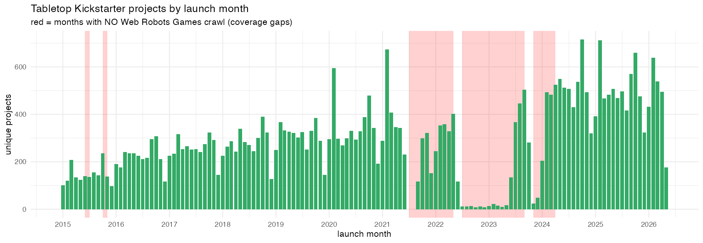

*All tabletop launches by month (board games included, not just RPGs), from the stitched-together monthly crawls. The red bands mark months where the **crawl** captured no Games category at all — note these are crawl months, not launch months, so the few projects still showing there were salvaged from much later crawls and badly undercount the real total. One such stretch coincides with the 2023 OGL crisis.*

First thing I checked was the success rate. The data said tabletop RPGs succeed about **98% of the time**. That number looks wildly inaccurate, and made me suspicious of the Web Robots data. Web Robots builds its snapshots from Kickstarter's public "discover" pages — and those pages overwhelmingly surface projects that are live or that succeeded. Campaigns that flopped quietly fall out of view and never make it into the crawl. So what the crawl really captures is the *survivors*, with the failures missing almost entirely.[^survivorship] A success rate computed from it therefore describes the survivors, not the full population.

This is survivorship bias, and it required a bit of additional thinking. It means there are two separate questions and they need different data:

1. **Did it get funded at all?** — You cannot answer this from a dataset with no failures.
2. **Given that it got funded, how much did it raise?** — This you *can* answer, because the survivors are exactly the population you care about.

So I went and found data that *does* include the failures. A widely-used Kaggle export covers 2009–2018 and includes the flops; an academic dataset from ICPSR covers 2009–2023 with all 610,000 Kickstarter projects, successes and failures alike.[^triangulation] Triangulating across three independent sources — using the failure-inclusive ones for "did it fund" and the rich Web Robots crawl for "how much" — is the basis of everything below.

When you bring the failures back, the real tabletop success rate isn't 98%. It's about **two-thirds** over 2009–2018, climbing to roughly **86% by 2023**.[^rate] Note that this is all tabletop products, including boardgames, because the ICPSR data do not allow me to subset to ttrpg products only. Tabletop has become one of the categories with the highest success rates, though it reached that point gradually.

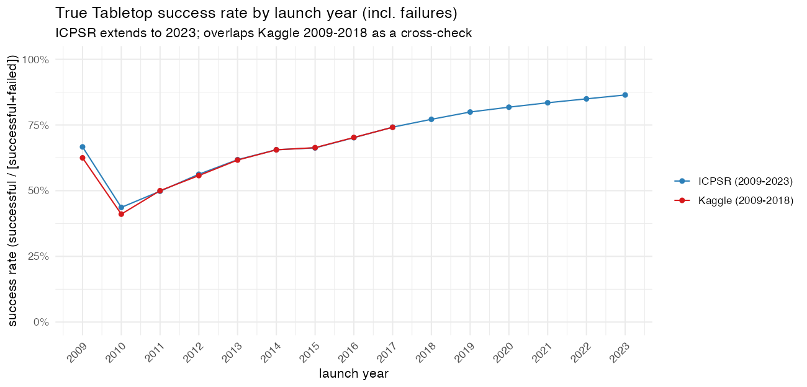

*The real success rate (successes ÷ finished projects), once you put the failures back in. Two independent datasets agree closely through 2018; the longer one carries the story up to ~86% by 2023.*

## A growing share of gaming crowdfunding

First, a sense of scale — how big is this corner of Kickstarter, and is it growing? It has grown most years. Across the funded dollars in Kickstarter's whole Games category, tabletop is far larger than the other subcategories, and the RPG share within it has risen steadily.[^market]

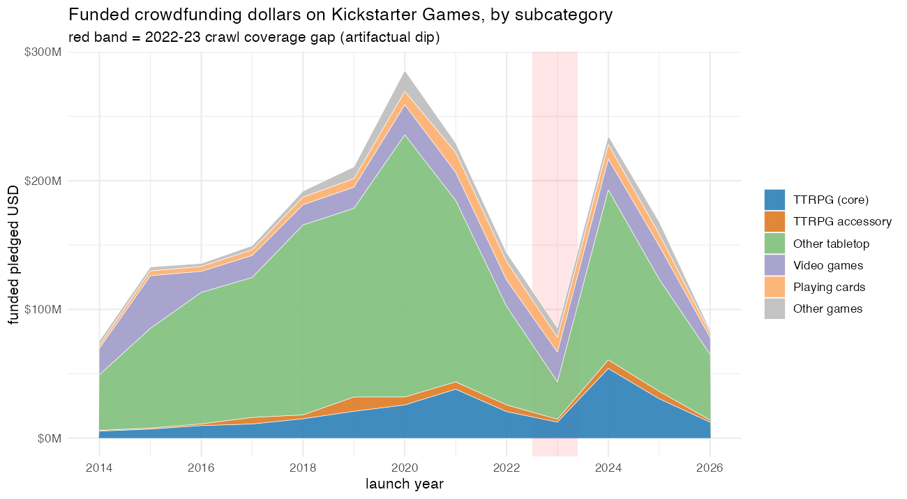

*Funded pledged dollars on Kickstarter's Games category, stacked by subcategory. Tabletop dominates — non-RPG tabletop (green, mostly board games) plus the RPG bands (blue core, orange accessories) at the bottom — and is far larger than video games, playing cards, and the rest. The red band is the 2022–23 coverage gap; the dip there reflects the missing crawls, not a real downturn.*

Let’s take a closer look at ttrpgs only. On *cleaned* labels (after removing the board games, dice, and card games a keyword classifier had mistakenly filed under "RPG"[^cleanlabels]), core RPGs go from about **7% of Kickstarter-Games dollars** in the mid-2010s to the **mid-to-high teens** by the 2020s. The raw line touches ~24% in 2024, but that single year is strongly affected by the $15M Cosmere RPG campaign. Trimming the top 1% of projects pulls even 2024 down near 14%.[^market] 

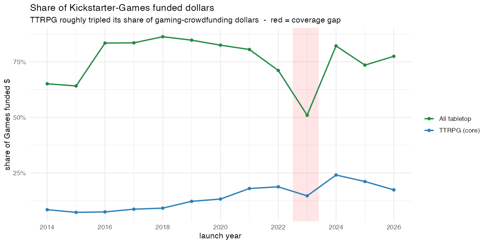

*Core RPGs' share of all Kickstarter-Games funded dollars (blue, cleaned labels), with tabletop's share overall (green) for context. Both rise; the RPG line roughly doubles — the 2024 spike toward a quarter is one $15M megaproject. (The 2022–23 dip reflects the coverage gap.)*

But "tabletop" is mostly *board games* when it comes to dollars. Line up each subcategory's share of the money against its share of the projects and you can see where the big money sits: board games take about **60% of the dollars on 44% of the projects**, while the cheap commodities — playing cards, RPG accessories — are the reverse, lots of projects but little money. Core RPGs land in between, raising roughly in proportion to their numbers.

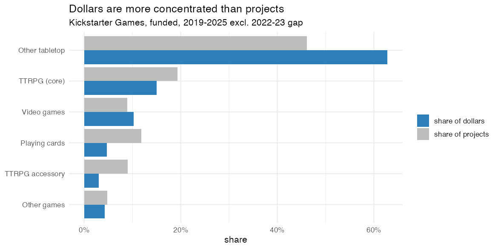

*Each subcategory's share of funded dollars (blue) vs its share of funded projects (grey). Where blue beats grey — board games, video games — is high-value territory; where grey beats blue — playing cards, accessories — is high-volume but cheap.*

## The dollar distribution among funded projects

Among funded projects, the distribution of dollars is strongly top-heavy. The **top 1% of funded RPG projects capture about 34% of all the dollars**; the top 5% capture nearly two-thirds. For accessories it is even more concentrated relative to their size — the top 1% pull in 38%. The whale post was studying the part of the distribution that holds most of the money.

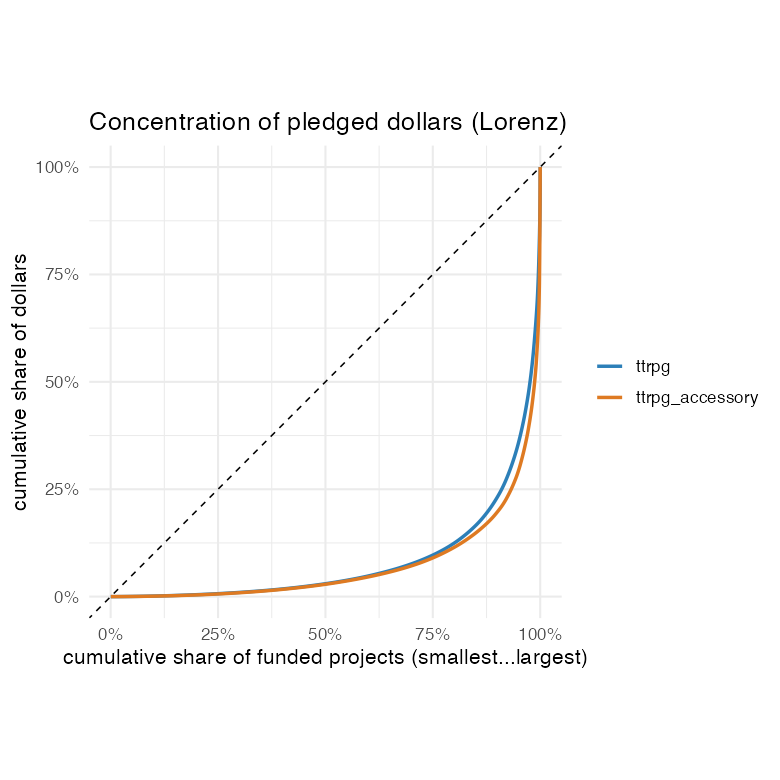

*How concentrated the money is. The sharp bend near the right edge means a tiny share of projects holds most of the dollars; a straight diagonal would mean perfect equality.*

The typical project is far smaller. A median *funded* RPG book raises around **$5,800** from a bit over 200 backers; a median funded RPG accessory (dice, minis, a GM screen) raises about **$3,000** from roughly 100 backers. The *per-backer* pledge is nearly identical for the two — about $30 either way. RPG books therefore pull ahead by attracting roughly twice as many backers at the same price point: the gap is driven by demand (the number of backers) rather than by the average pledge.

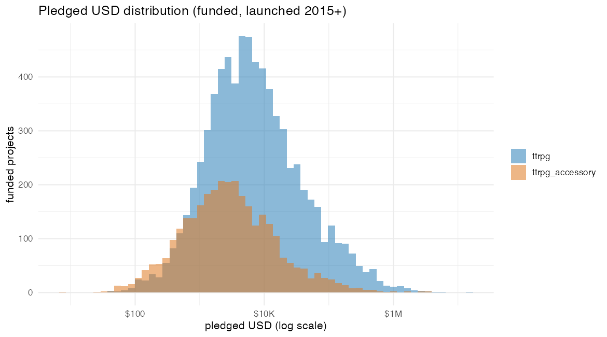

*What funded projects raise (log scale). RPG books sit to the right of accessories — they raise more — but both distributions have a long tail reaching toward the millions.*

Accessories, meanwhile, are different. Their median funding goal is **about $400**, and they exceed it comfortably: 86% of funded accessories raise at least double their goal, versus 76% for books. "Set a tiny goal and overfund” seems to be a common strategy, especially for accessories.

## Goals and Clocks

Two numbers a creator picks before anything else are the **goal** (how much to ask for) and the **clock** (how long to run). RPG goals cluster in the low thousands (accessories a notch lower, in the hundreds), with the telltale spikes at round numbers like $1,000 and $5,000.

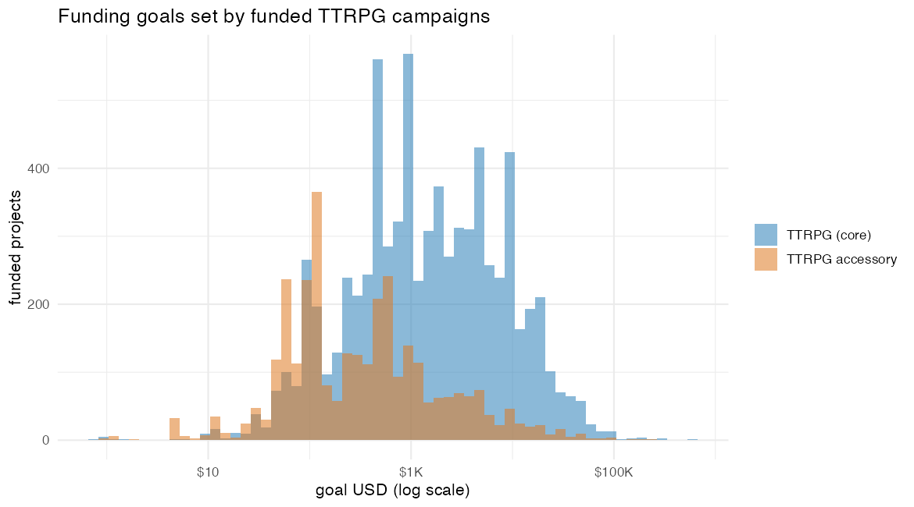

*Goals set by funded campaigns (log scale). Core RPG books cluster around $1–5K; accessories sit lower. The vertical spikes are round-number goals.*

Goals have fallen markedly over the decade. The median funded RPG book asked for about **$4,000 in 2016 but only ~$600 by 2024**; accessories fell more steeply, from ~$2,500 to about $100. Part of this is the zine wave — small-format projects with tiny goals became common after 2019 — and part is creators gravitating to a modest, beatable goal as the safe default.[^goaltrend]

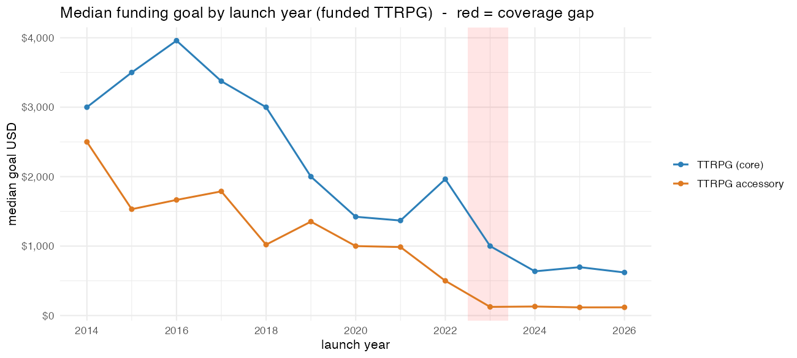

*Median goal by launch year (funded only). Goals more than halved over the decade, with the post-2019 slide tracking the influx of small-goal zines.*

The clock is even more uniform. The overwhelming majority run the platform's **30-day default**, with smaller clusters at two and three weeks and almost nobody past 60 days. Campaign length is a variable creators barely change.

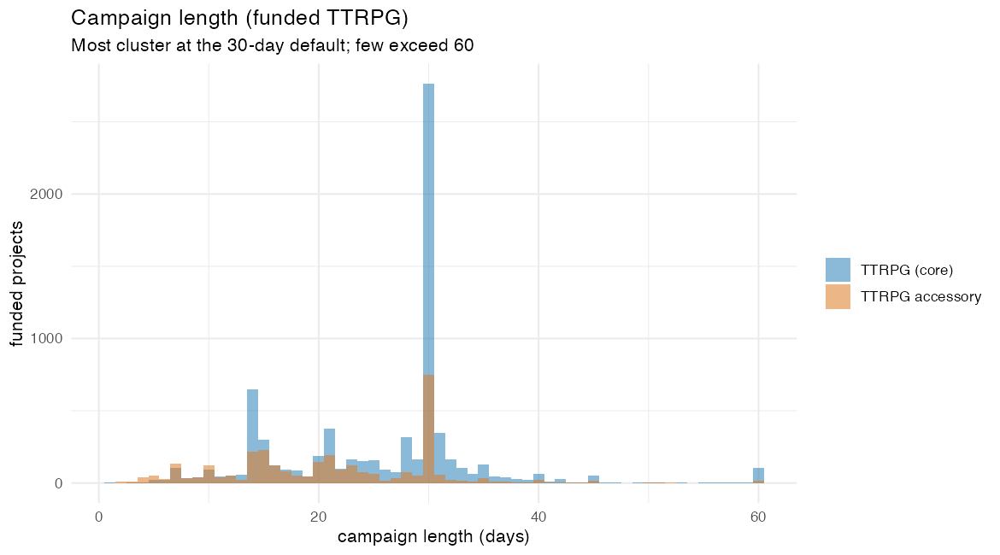

*Campaign length in days (funded). The spike at 30 is Kickstarter's default; few creators stray far from the common two-to-four-week window.*

## The shift toward D&D 5e

Before asking what *succeeds*, it's worth looking at what people even make and how that's changed. Over the decade the *mix* of funded RPG books shifted substantially. Books that name **D&D's fifth edition** went from about **7%** of funded RPG books in 2014–15 to nearly **40%** by 2023–26. The old-school renaissance (OSR) more than doubled its share, the long tail of titles that don't name any system steadily receded as more creators hitched their book to a recognizable engine, and Pathfinder *shrank* in relative terms as 5e came to dominate the hobby.[^composition]

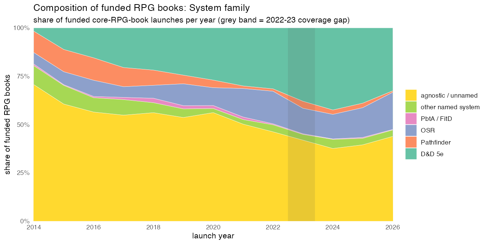

*The shifting mix of funded RPG books by system. The D&D 5e band (top) swells from a sliver to ~40%; OSR grows; the "agnostic / unnamed" base shrinks as books increasingly name a system. The grey band is the 2022–23 coverage gap.*

But "a 5e book" and "an indie-system book" are usually different *kinds* of objects:

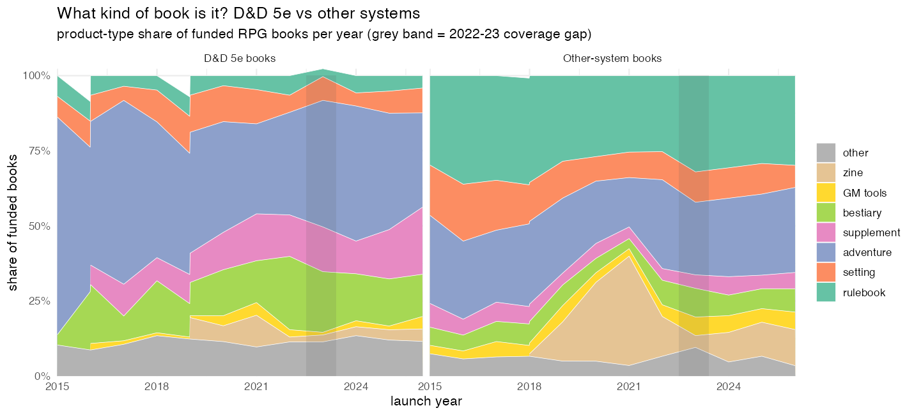

*What kind of book is it? D&D 5e books (left) versus everything else (right). 5e is mostly adventures and supplements; other systems are where new rulebooks and zines live.*

D&D 5e is something people publish *for*: about **40% of 5e books are adventures**, another quarter are bestiaries and supplements, and only ~6% are new core rulebooks. Other systems are where new *games* live — about a third are rulebooks — and they're also where the zines cluster (**12%** of other-system books, versus ~4% of 5e ones). One ecosystem extends an existing system; the other produces new ones. 

## Getting funded depends more on who than what

Now the question the survivor data couldn't speak to. Using the failure-inclusive datasets, I asked Claude to build models to predict funding success and checked how well they did out-of-sample, not merely how well they fit in-sample.[^auc] One to keep in mind for this whole section: the failure-inclusive data is either name-identified only through 2018 or not RPG-specific. Because the Kaggle export keeps project names, I *can* run the keyword classifier on it and isolate RPG projects — but only through 2018; ICPSR masks names, so it stays whole-tabletop. So the funding-side story leans on tabletop crowdfunding in the 2010s and may not perfectly describe the ZineQuest-era RPG market of the 2020s.[^fundingera]

I started with two models with different kinds of information. One knew only about the **creator**: how many projects they'd run before, how many succeeded, how many failed. The other knew only about the **project**: its genre, its goal, its country, its title.

The creator model came out ahead — AUC about **0.83** against the project model's **0.72**[^whovwhat] but the two models are built on *different* datasets (only one source pairs creator IDs with failures; only the other carries project names), and the creator-history model isn't even RPG-specific — so this is a decomposition *across sources*, not a head-to-head on the same projects. Read with that caveat, the core finding is consistent and one-directional: *who is asking* looks at least as predictive as *what they're asking for*. A creator's prior track record is the strongest single predictor I found: each past success multiplies the odds of funding, a strong prior success *rate* multiplies them a lot, and — symmetrically — **past failures predict future failure**. Reputation compounds in both directions.

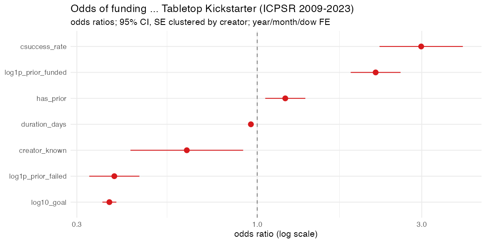

*What predicts getting funded, from the creator-history model (odds ratios). Bars to the right of 1 improve the odds — a strong prior success rate most of all — while prior failures (left of 1) drag them down.*

This also explains the rising success rate. As the platform ages, a bigger and bigger share of launches come from people who've done it before and succeeded. The market may not have become easier; rather, the pool of creators became more experienced.

You can see it in the descriptive data as well. Splitting each year's RPG launches into first-timers and creators we've already seen, the returning share climbs from almost nothing in the early years to roughly half by the 2020s.

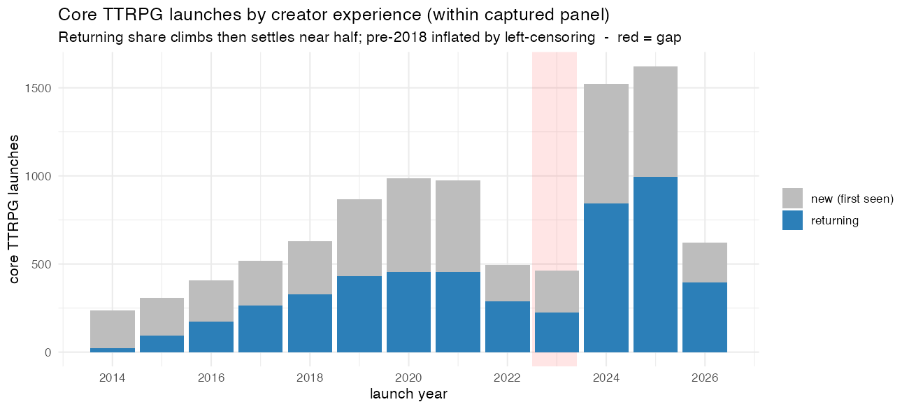

*Each year's core RPG launches, split into creators making their first appearance (grey) and those seen in an earlier year (blue). The returning share grows as the scene matures. The earliest years are mechanically low, though — with the data starting in 2014, nobody *can* be "returning" at first.*

The project attributes still matter, just less. Holding other things equal: an actual RPG is more likely to fund than a board or card game; a "5E-compatible" or D&D/Pathfinder label helps further; US-based projects do a bit better. And there's the perennial Kickstarter finding — **modest goals fund more reliably.** Each tenfold increase in the goal cuts the odds of funding by roughly two-thirds.

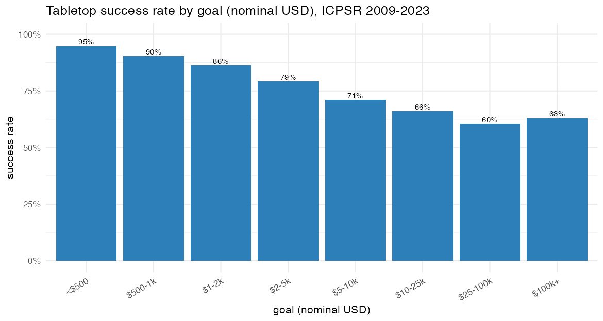

*Success falls steadily as the goal climbs. But read this as "who sets what," not as a lever — cautious creators with small audiences are the ones choosing the small goals.*

A warning on that last one, because it's an easily misunderstood statistic: this is a *correlation*, and the goal is not randomly assigned. Creators set goals in anticipation of demand — a cautious creator with a small audience sets $2,000; a publisher with a big mailing list confidently sets $80,000. So "low goals succeed more" does **not** mean "lower your goal and you'll succeed." The number tells you which kind of creator picks which kind of goal; what would happen if a given creator trimmed their own is a question it cannot answer. (I return to this point below.)

## Among funded projects, what drives the size of the raise

For the magnitude question — how big does a funded project get — I switched back to the rich Web Robots data, which is exactly the funded population. The standouts, expressed as "multiply the dollars by roughly":

- **A Kickstarter staff pick ("Projects We Love"): ×2.6.** By far the strongest factor in the list.
- **A repeat creator: ×1.4.** The backer-base premium again.
- **Having a video: ×1.13.** Modest but real — though measurable only on recent campaigns.[^video]
- **Being a zine: ×0.73.** Zines are small *by design*.

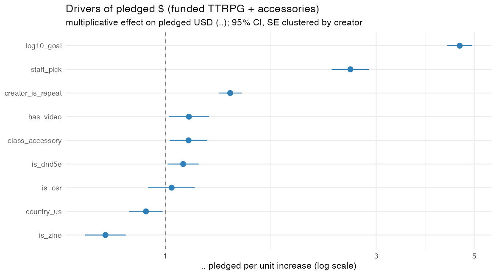

*Correlates of raising more, among funded projects — multiply the dollars by the value on the axis. A "Projects We Love" staff pick travels with ~2.6× the money; a zine, with less.*

I'm deliberately leaving the funding goal off that list even though it has the largest coefficient, because for funded projects its effect is mostly **mechanical**: if you raised enough to succeed, you by definition cleared your goal, so a bigger goal mechanically sets a higher floor.[^goal] 

Two further points. First, I fed each campaign's *text* — titles and blurbs — into the model, restricting to *books* (in the pooled book-plus-accessory sample, physical-product words like "miniatures" and "scenery" mostly flag the accessory class rather than a wording effect). The text adds only modestly to predictive power, and the strongest individual terms are partly a caution about the method: several are **brand and series names** — *Mothership*, *Forbidden Lands*, *Root*, *Dimgaard* — which a bag-of-words model memorizes as "these named lines did well" without the lesson generalizing to a new project.[^text] Two patterns generalize better. Naming a **physical print format** predicts a larger raise: books that mention a binding raise well above the PDF-only and zine baseline (hardcover most, ~$25k median; softcover ~$13k; neither ~$6k) — the word marks a printed object, not a deluxe one. And advertising **broad system compatibility** helps — blurbs that enumerate several compatible systems ("…AD&D, 5e, DCC, Pathfinder, OSR…") reach a wider audience and raise more. At the other end, "pay what you want," "one-shot," and "online" framing predicts raising *less* — the small-format, give-it-away end of the market.

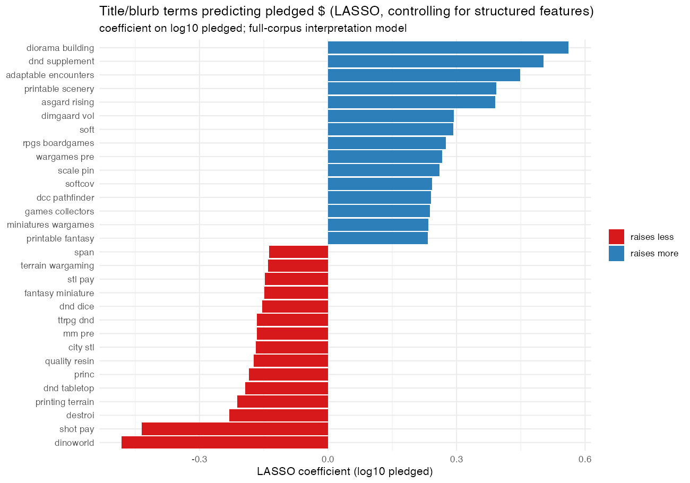

*Title/blurb terms predicting how much a funded RPG **book** raises (LASSO, controlling for the structured features). Read with care: several of the strongest "raises more" terms (blue) are brand/series names the model has memorized, or tokenization artifacts — "dcc pathfinder" is two adjacent items in a system-compatibility list, and "softcov" marks a printed book, not a premium binding. The generalizable signals are naming a print format and broad system compatibility; "pay-what-you-want" and one-shot framing (red) predict less.*

Second, the staff-pick and video effects get *stronger* the further up the distribution you go. For a median project a staff pick is worth maybe 1.5×; for the runaway hits near the top it's associated with more like 3.5×. Social proof and production polish are amplified in the upper tail. (Correlation again — Kickstarter may hand out staff picks to projects it can already tell will be big — but it's a suggestive pattern.)

### Naming a recognized system raises more

Since I'd tagged every book by its system, I could ask a sharper version of the old "5E helps" folk wisdom: among funded books, does naming a recognized engine correlate with more money? Relative to a system-agnostic book, naming a known system is worth a roughly **25–45% bigger raise** — **D&D 5e ×1.32, OSR ×1.26**, and the named indies (Call of Cthulhu, Mothership, and similar) **×1.43**. Pathfinder and the PbtA family are statistically indistinguishable from agnostic. 

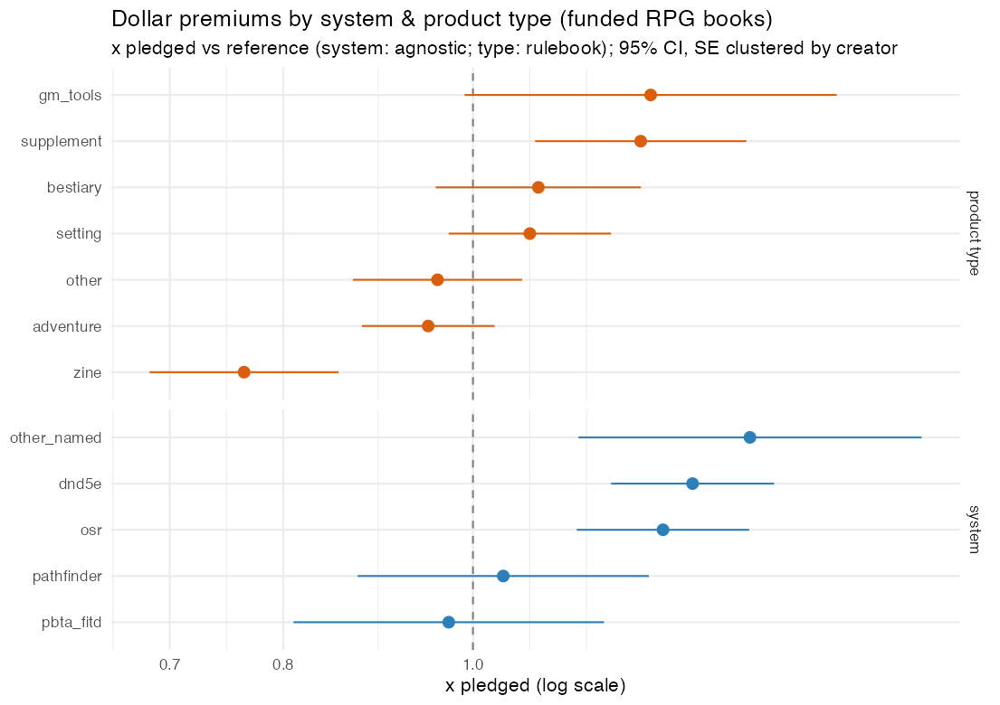

*Multiply-the-dollars premiums for funded RPG books, versus a system-agnostic rulebook. Naming a recognized system (blue) pays; product type (orange) matters less, except that zines raise less.*

In the failure-inclusive data, books that name a recognizable system are also meaningfully more likely to **get funded at all**. Naming a system seems to reassure backers that an audience already exists for the thing. That said, all of this is second-order: adding the system and product tags barely changes how well the model predicts dollars, and goal-setting, reputation, and the staff pick remain the dominant predictors.[^sysprem]

## Where books and accessories diverge

Because I'd split RPG books from RPG accessories, I could ask whether they respond to the same things. The answer reveals a small asymmetry.

For **how much you raise**, the drivers genuinely differ. The starkest example: a "5E-compatible" label *raises* money for a rulebook but is slightly *negative* for an accessory.[^bookacc] That makes intuitive sense — a branded D&D *book* is a selling point, but generic "D&D dice" or "D&D minis" are a commodity in a crowded field. Being US-based flips sign too.

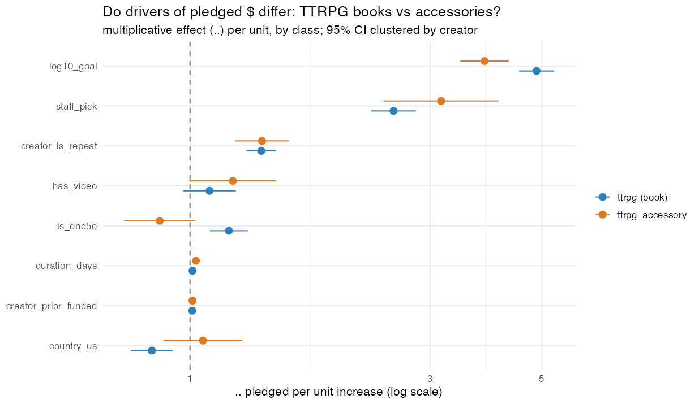

*Same drivers, different products. The book effect (blue) and accessory effect (orange) pull apart — most strikingly for the 5E label, which lifts books but not commodity minis.*

For **whether you get funded**, though, the drivers *don't* meaningfully differ between books and accessories. The things that get you across the funding line (a modest goal, a reasonable campaign length, an established creator) seem to work about the same regardless of what you're selling.

So: **product type shapes how much you raise, but not whether you raise it.** 

## Testing whether 5e caused the boom

It is tempting to credit the rising RPG fortunes of the last decade to obvious cultural events — 5th edition in 2014, *Stranger Things*, *Critical Role*. But that is hard to show in the data. 

The honest way to test "did event X cause the RPG surge" is a difference-in-differences: compare RPGs (which event X should affect) against board and card games (which it shouldn't) before and after, so the platform-wide trend cancels out. When I do this for **5th edition's mid-2014 release**, the result is a clean *null*. The RPG advantage over other tabletop games was **already present in 2012**, two years before 5e shipped, and it continued afterward. There is no break at the release.[^did5e]

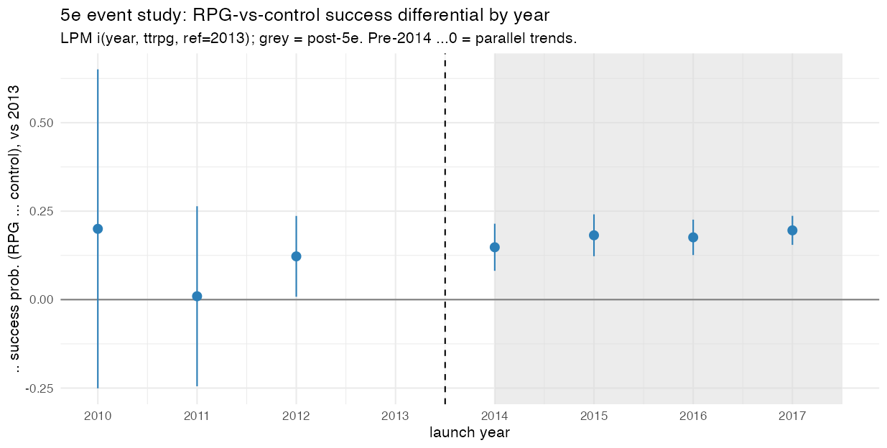

*The 5e effect that does not appear. The RPG-vs-control success gap is already positive in 2012 and flat across the mid-2014 release (dashed line) — no jump, and no clean causal story.*

The ttrpg boom is real, but pinning it on 5e specifically doesn't seem to be supported in the data. The treatment was too gradual and too anticipated, and 5e probably lifted D&D *board games* too, contaminating the comparison. *Stranger Things* and *Critical Role* are even harder to test cleanly, so I won't.

The 5e test came up empty, but one effect does appear clearly in the raw data. Sort core RPG launches by calendar month and one month departs from the pattern, but only recently. Through 2018, February was unremarkable; from 2019 on it swells to more than **a fifth of the whole year's launches**.

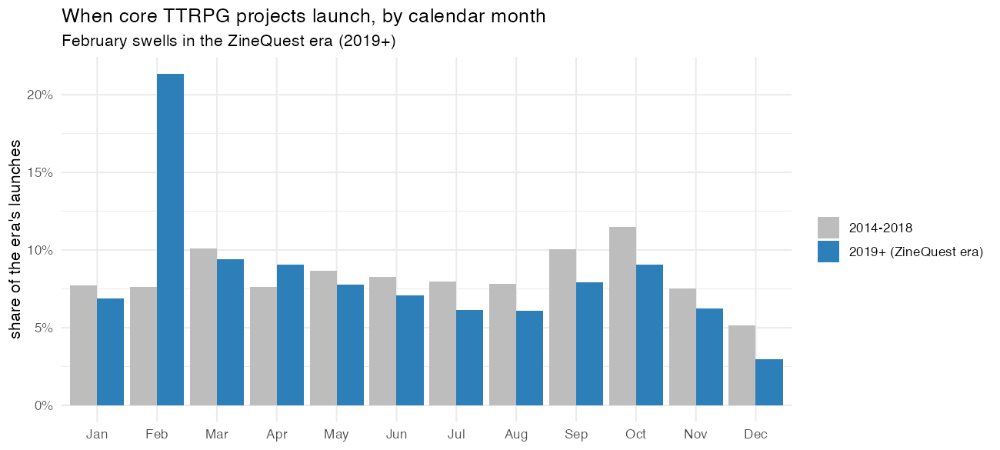

*Share of core RPG launches by calendar month, split into 2014–18 (grey) and 2019+ (blue). February rises from an ordinary ~7–8% to ~21% once the later era begins — a clear seasonal pattern.*

That February bump is the work of **ZineQuest**, Kickstarter's annual February push for RPG zines, launched in 2019 — and unlike the diffuse 5e rollout, it's sharp enough to actually test. This one is closer to a natural experiment, precisely because it's *RPG-specific*. Kickstarter promotes RPG zines, not board games, so board games make a useful control group. And the effect is unmistakable: funded RPG launches **roughly double every February** in the ZineQuest era, relative to what the season and the trend would predict, with no such jump beforehand.[^zinequest] The *mechanism* is specific. ZineQuest worked through volume: it drew a large number of *small* zines that would not otherwise have launched, while leaving the size of the typical project unchanged. The February cohort is 41% zines (versus 3% the rest of the year), and its median pledge is less than half the usual. The program lowered the barrier to small-format publishing, and many creators participated — as the program intended. One threat I can't fully dismiss: the data captures the projects Kickstarter *promotes*, and ZineQuest is itself a promotion push — so some of the February jump could be promoted zines becoming more *visible* to the Web Robots crawl rather than purely more *numerous*. The board-game control soaks up platform-wide visibility shifts, but not one aimed specifically at RPG zines, so I'd treat the exact size of the effect as suggestive even though its existence is hard to explain away.

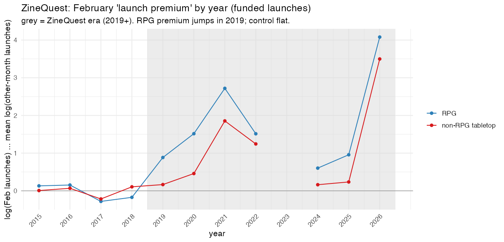

*The ZineQuest effect. The February "launch premium" for RPGs (blue) is flat before 2019, then rises when the program starts and stays elevated — while the board-game control (red) does not.*

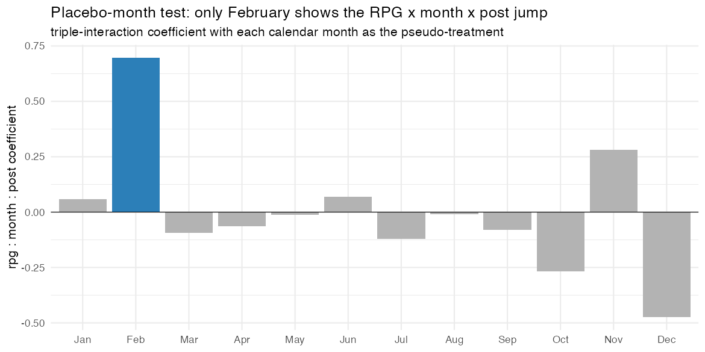

*A placebo check: re-run the test pretending each month is the "treatment." Only February (highlighted) shows the jump — strong evidence the effect is ZineQuest, not noise.*

### The funding threshold isn't a clean experiment

A final causal design is a regression discontinuity at the funding goal. Kickstarter is **all-or-nothing**: reach 100% of your goal and you collect the money; finish at 99% and you get nothing. Two campaigns that end at 99% and 101% are, in terms of underlying demand, nearly identical — yet one is "funded" and one is not. That sharp line looks like a natural experiment: line up the just-funded against the just-missed and ask what *getting funded* does to a creator's future — do they come back and launch again?

For Kickstarter projects, this does not work. When I plot where projects actually land relative to their goal, there are very few just below the line and many just above it: in the failure-inclusive data only **94 projects** finished in the 90–100% band, against **1,373** in 100–110%.

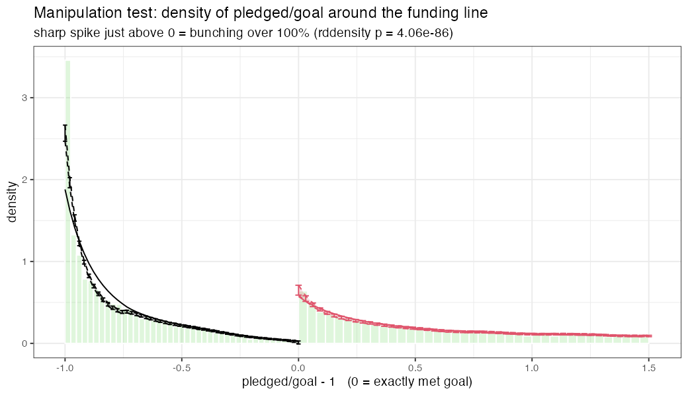

*The manipulation test. If 100% were a clean dividing line, the density would be smooth across it; instead it jumps — almost nobody ends* just *short, because near-misses get pushed over.*

This is **manipulation at the threshold**, and it is benign: as a campaign nears its goal in the final days, the creator and their friends push it over, and last-day momentum carries it across, so almost nobody ends *just* short. But it invalidates the design — the projects sitting just above the line are not interchangeable with the ones just below; they are precisely the ones that *managed to cross*. The naive "effect of funding" is correspondingly fragile: sizable under one specification, gone under a slightly different one. Setting the causal design aside, the descriptive relationship is still informative: the more a campaign raises relative to its goal, the more likely the creator is to launch again — with no discontinuity at the threshold itself.[^rd]

I would also have liked to study the **2023 OGL crisis** — Wizards of the Coast's botched attempt to revise the Open Game License, which alarmed many RPG creators — as a shock to the system. I cannot: the Web Robots crawl has a gap in its coverage that sits *exactly* on top of January 2023, and the only failure-inclusive source that reaches that far masks project names, so I cannot identify the RPGs.[^ogl]

## Back to the whale tiers

The whale post's question — how the money splits across a campaign's reward tiers — is the one I began without the data to answer, since tier-level prices and backer counts are only available on individual campaign pages, not in any of the bulk datasets. So I went back and recovered them (with the help of Claude), reading the *archived* campaign pages from the Internet Archive's Wayback Machine rather than scraping Kickstarter directly.[^tiers] About half of the top-decile RPG books had an archived page complete enough to use — 325 books, roughly 3,300 tiers — so this is a doubly selected sample, and approximate: per-tier price × backers recovers about three-quarters of each project's total, the rest being over-pledges, add-ons, and shipping.

The first finding matches the whale post on a much larger sample. The cheap tiers draw most of the backers; the premium tiers hold most of the money. Sorting every tier by price, entry tiers under $25 account for about a seventh of all backers but under **3% of the dollars**, while the $100–500 band holds roughly a quarter of the backers and **over half the dollars**.

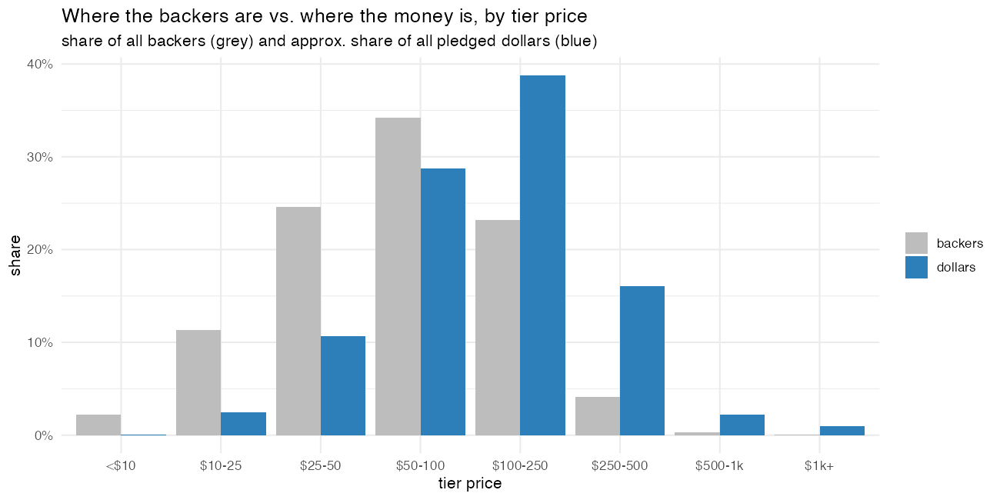

*Every reward tier sorted into price bands: share of all backers (grey) vs. approximate share of all pledged dollars (blue). Backers cluster at $50–100; the dollars shift right to the $100–500 premium tiers.*

The RPG-book "whale" sits a little lower than in the original post. Defined the same way — the single most-expensive tier in a campaign — the median top-priced tier among these books is about **$359**, versus **$478** across the million-dollar megaprojects. But the more striking pattern is that this ceiling tier isn’t where the money is made: the **highest-grossing tier of the median book is only about $99** — roughly the price of a deluxe hardcover. The expensive tier exists; few people buy it.

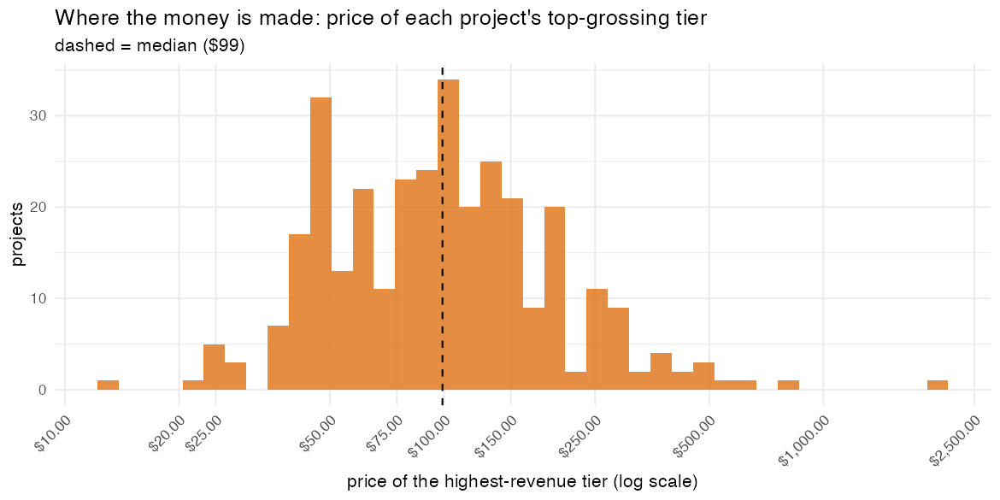

*The price of the single highest-revenue tier in each project, which clusters near $100 (median, dashed) — the deluxe-book price point, and far below each book’s own most-expensive tier (median $359).*

Nor is the money concentrated in one ceiling tier. The median book offers nine tiers, and its single highest-priced tier accounts for only about 4% of its money — the top tiers are expensive but thinly subscribed. The dollars come from the mid-priced premium tiers, not the most expensive ones.

One cautious note on whether tier *design* tracks raising more: projects that earn a larger share of their revenue from the high-end tiers do raise much more overall, but that is largely mechanical — a big campaign has whales because it is big — so it is not a lever. The *number* of tiers barely matters, and a high ceiling price on its own, holding the whale share fixed, is if anything slightly negative: a top tier few people buy does not help.

## What the evidence supports

If you're running an RPG Kickstarter, the evidence-backed takeaways are: your **track record is your biggest asset** (and your past failures follow you); a **modest goal** correlates with funding, though that mostly reflects which creators set small goals in the first place; a **staff pick and a video** travel with much bigger raises; **naming a recognized system** — 5e, OSR, a known indie line — is associated with both clearing the funding bar a little more easily and a somewhat larger raise; **how you frame the product** — premium object versus cheap commodity — shows up in the dollars; and within a campaign, the money comes from the **mid-premium reward tiers** ($100–500), not the entry PDFs or a single high-priced ceiling tier.

What I *wouldn't* tell you is that any of these are guaranteed levers. Almost everything here is a correlation drawn from observational data, with all the usual hazards: creators choose their goals strategically, Kickstarter chooses who gets staff-picked, my RPG classifier is right only about three-quarters of the time,[^classifier] and the one result that is in the neighborhood of a causal effect is about a niche February program for zines.

The whale post asked how the giants price their tiers; recovering the tiers for the top decile of funded books gave a broader, smaller-scale version of the same answer — the money sits in the mid-premium tiers, and the book whale is a ~$100 hardcover. Moving from the fifty-three giants to the full forty-five thousand, the RPG corner of Kickstarter is one in which a handful of projects attract most of the money, most projects are small and increasingly likely to succeed, reputation compounds, and a modest February intervention by the platform raises the number of small zines. 

---

### Footnotes

[^whales]: The original analysis ("Kickstarter Whales," guest post by Scipio202 on Patchwork Paladin) used ENWorld's list of 53 tabletop RPG campaigns that raised ≥ $1,000,000 and tracked four price points per campaign (cheapest digital, cheapest physical, most-common, and the top "whale" tier). It's a tier-level study of mega-successes; this post is a population-level study of the whole category.

[^classifier]: I validated the classifier on fresh, held-out Claude hand-labeled samples it had never seen: about 88% precision with recall preserved (no missed RPGs among the sampled non-RPG items) for the core-RPG class — up from ~77%/71% before I tightened it. The residual errors are mostly RPG accessories (map packs, dice, card decks) filed as core books rather than wholly unrelated products. For the regressions this label noise mostly behaves like random error that understates category differences (so those contrasts are conservative); for the dollar-share aggregates it is handled by the classifier cleanup.

[^survivorship]: Concretely: in the Web Robots data only about **2% of finished tabletop projects are marked "failed,"** versus a real-world failure rate somewhere around a third to a half. The crawl is essentially "the successful subset." A reassuring cross-check: where the survivor data and the failure-aware data overlap, the funded projects' dollar amounts and backer counts match almost exactly — so the bias is in *which projects appear*, not in the numbers attached to them.

[^triangulation]: The three sources have complementary strengths and weaknesses. Web Robots: rich detail (video, staff pick, full text, creator IDs), 2014–2026, but funded-biased. Kaggle "ks-projects": includes failures and project names, but ends in early 2018. ICPSR 38050: includes failures through 2023 and has a usable creator ID, but masks project names (so I can identify RPGs only by linking to the other two). No single source does everything; the analysis assigns each question to the source that can answer it honestly.

[^rate]: "Success rate" here is successful ÷ (successful + failed), the standard convention. The two independent failure-aware sources agree closely on the 2009–2018 overlap (about 67% vs 69%), which is the kind of cross-source agreement that makes me trust the number.

[^auc]: I report out-of-sample discrimination (AUC, the area under the ROC curve): 0.5 is a coin flip, 1.0 is perfect. I also checked several model types (logistic regression, LASSO, random forest) and they agreed, which is a sign the result isn't an artifact of one method.

[^whovwhat]: The creator-history model reached an AUC of about **0.83**; the project-attribute model about **0.72**. They're built on different datasets (only one source has creator IDs *and* failures; only the other has project names), so this is a decomposition across sources rather than a head-to-head in one regression — but it's robust, and "reputation beats genre" is the clear message.

[^goal]: Among funded projects, pledged dollars are ≥ the goal essentially by definition (I checked: 0.00% of funded projects came in under goal). So the strong goal-pledged relationship for *funded* projects is largely an accounting identity, not behavior. I keep the goal in the model only to hold project scale constant while reading the other coefficients.

[^video]: A wrinkle in the data: Web Robots only started recording whether a campaign has a video in its April 2024 crawls. Every project last seen before then is logged as "no video" regardless of the truth, so the video effect is identified entirely off campaigns captured in 2024 or later — where, reassuringly, it's if anything a touch larger (about ×1.17). Read it as a recent-campaign association rather than a decade-long one, and that's also why I never plot video presence over time.

[^text]: Method, briefly: among funded RPG books, I turned titles and blurbs into a bag of words and bigrams and let a LASSO pick which ones predict log-dollars, with the vocabulary chosen separately inside each cross-validation fold so the test data couldn't leak in. Adding text lifted out-of-sample R² from about **0.68 to 0.70** — real but modest. Two cautions on interpretation. (1) The model memorizes specific successful *series/brand names* (Mothership, Forbidden Lands, Root, Dimgaard), which don't generalize. (2) Some "terms" are artifacts of how the text is tokenized: the bigram "dcc pathfinder" is not a product but two adjacent items in a system-compatibility list ("…AD&D, 5e, DCC, Pathfinder…"), and "softcover" is not a premium binding but a marker that the book is printed at all — books that name *any* binding raise well above the PDF-only/zine baseline (hardcover ~$25k median, softcover ~$13k, neither ~$6k). The parts worth keeping are those structural signals — a physical print format and broad system compatibility — and the low-end "pay-what-you-want / one-shot" pattern. I restrict this to books because in the pooled book-and-accessory version the strong terms were physical-product words (diorama, scenery, minis) that mostly identify the accessory class.

[^bookacc]: Formally, a joint test that all the book-vs-accessory differences are zero is decisively rejected (p < 0.00001) for the *magnitude* question, but is not significant (p ≈ 0.07) for the *funding* question. Translation: the slopes really do differ for "how much," but not for "whether."

[^did5e]: In an event study, the RPG-vs-control success gap is already positive and sizable in 2012 and flat thereafter; the formal "did the gap jump after mid-2014" interaction is statistically indistinguishable from zero for both funding and dollars. This is a textbook example of why diffuse, anticipated "events" resist clean causal identification.

[^zinequest]: The estimate is about a 2× increase in funded RPG February launches. Because the comparison effectively has only ~12 years of data ("clusters"), a naive significance test overstates confidence; I re-ran it with a wild cluster bootstrap and a placebo test that asks whether any *other* month shows the same jump (none does — February is the unique outlier). The effect holds up. It's also worth noting this measures funded *entry* and dollars, not the success rate, since the rich data still can't see failures.

[^ogl]: Two independent problems collide on the OGL window: a source-side hole in the monthly crawl from mid-2022 to mid-2023 (which I verified is real, not a mistake on my end), and the name-masking in the only failure-aware source that reaches 2023. With neither entry, success, nor dollars observable for RPGs around January 2023, an honest event study isn't possible. A targeted re-scrape of that window is the way to revive it.

[^tiers]: Kickstarter's bulk datasets carry only campaign-level totals, so I recovered tier prices and per-tier backer counts from *archived* copies of the campaign pages on the Internet Archive's Wayback Machine — never hitting Kickstarter directly — by parsing the project data embedded in each snapshot. Coverage is partial: of the top decile of funded RPG books, about half (325) had an archived page near the campaign's end with parseable tiers. I used the snapshot closest to but not after the deadline, since Kickstarter hides ended tiers once a campaign closes. As a check, the per-tier backer counts sum to the project's own total to within a few percent; treating tier revenue as price × backers recovers about 76% of pledged (the remainder is over-pledging, add-ons, and shipping, which the page total includes but the per-tier figures do not).

[^composition]: System and product-type tags come from keyword rules on each book's title and blurb, assigning one label per axis by a priority order. They're fuzzy — PbtA and other indie systems are *undercounted* because those books rarely say "PbtA" on the tin, and a chunk of books name no system at all — so read the trends and the broad shares, not the second decimal. The composition charts are funded books only (the rich crawl can't see failures), and the 2022–23 coverage gap thins those years.

[^sysprem]: Same funded-books regression as the magnitude model above, now with the system-family and product-type tags added (premiums are relative to a system-agnostic rulebook, standard errors clustered by creator). Honesty about effect size: adding the tags lifts cross-validated R² only from about 0.675 to 0.683 — real but small. The success-side claim uses the failure-aware Kaggle data, where adding the tags improves out-of-sample discrimination from AUC ≈ 0.70 to ≈ 0.74; those tags are name-only (no blurb) and pre-2019, so treat them as suggestive. As everywhere here, keyword-tag noise attenuates the contrasts toward zero, so if anything these premiums are understated.

[^rd]: This is a regression-discontinuity design at the 100%-of-goal cutoff, run on the failure-aware data (the only source with the just-missed projects on the left of the line). The formal manipulation test (McCrary/rddensity) rejects a smooth density overwhelmingly (p ≈ 4×10⁻⁸⁶), which invalidates the design. For the record, the naive estimate of "barely funding → relaunching" is about −0.28 under a local-linear fit but a non-significant −0.10 under a local-quadratic one — exactly the instability you expect when the running variable is manipulated. What's robust is the smooth dose-response on both sides: more raised relative to goal predicts a higher chance of launching again.

[^market]: A few caveats. These are *funded*-project dollars (the survivor population the rich crawl captures), but dollar totals are the most capture-robust thing here — failed campaigns raise almost nothing, so the trend is trustworthy even where raw counts aren't. "Games" means Kickstarter's Games category — tabletop, video games, card games, and so on — not the whole platform; I can't line RPGs up against Film or Comics because I only kept the Games category. And a robustness note on the share itself: because the money is so concentrated, a single huge project can swing a year. The 2024 peak (~24%) is the clearest case — strip the top 1% of projects each year and the whole series falls to roughly 7% → 14%, which is why I describe it as a *doubling* rather than reading the raw 2024 number literally.

[^cleanlabels]: An earlier cut of this used a keyword classifier that mislabeled some board games, dice sets, and card games as "RPGs." Because the data is so dollar-skewed, a few of those swung the aggregates hard — *Darkest Dungeon: The Board Game*, a $3.9M card game, a $3.5M dice gadget and the like were about **13% of "RPG" dollars overall and 22% of the top 1%**. I tightened the classifier so board/card/video-game and accessory cues override a stray "RPG" mention (a game stays "RPG" only if its title actually says "roleplaying game" or it has real rulebook content); on the high-dollar tail it now agrees with hand-checking about **97%** of the time. Reassuringly, this barely moved the regression results — coefficients shrug off a handful of mislabels, and label noise mostly *attenuates* contrasts — but it did trim the dollar-share and concentration figures, which one big mislabel can distort. The share-of-gaming numbers above are post-cleanup.

[^goaltrend]: Among funded projects only, so read it as "goals among projects that made it," not the full population. Part of the decline is compositional — the post-2019 flood of small-goal zines drags the median down — and part is creators simply gravitating to modest, beatable goals as the norm.

[^fundingera]: Concretely: the Kaggle export carries project *names* (so I can pick out RPGs) but ends in early 2018, while the academic set reaches 2023 but masks names (so its RPG-level signal is borrowed, and its creator-history model is really an *all-tabletop* model). Either way, the "did it fund / what predicts funding" evidence is anchored in the 2010s and in tabletop broadly. The magnitude ("how much") side, by contrast, uses the 2014–2026 Web Robots crawl and is genuinely RPG-specific and current — so the time-scope caveat bites hardest on the funding-side claims, less on the dollars-side ones.
