:::notice
**Code & data:** This page is the write-up. The full reproducible pipeline (Python + R), figures, and tables can be found in [this repository](https://github.com/alchemical-lich/ttrpg-kickstarter).
:::

*Note: Caveat Emptor. This was just a fun weekend exercise, which means I leaned a lot on Claude Code to help with the writing of code and text. While I checked a lot of elements, I did not vet every single line of code. Claude sometimes does boneheaded stuff, so please consider everything as preliminary.*

I recently read [a great guest post on Patchwork Paladin](https://patchworkpaladin.com/2026/05/18/kickstarter-whales-guest-post/) about Kickstarter "whales" by Scipio202, on the reward tiers of fifty-three tabletop RPG campaigns that raised a million dollars.[^whales] It found that across those mega-projects the high-end "whale" tiers brought in roughly 23% of all the money, against under 4% for the cheap entry tiers, and that the median whale tier sat at about $478.

While pretty interesting, the post focuses on a heavily selected sample of projects: the most successful mega campaigns. It left me curious about how the rest of Kickstarter's RPG projects fare. What separates the ones that get funded from the ones that don’t? Does the whale pattern hold for a book raising five thousand dollars rather than five million?

## Getting the data

There's a nice free resource called Web Robots that has been crawling Kickstarter roughly once a month since 2014 and posting the results. With the help of Claude, I stitched together more than a hundred of those monthly snapshots, deduplicated everything, and ended up with about **45,000 tabletop-games projects**. Tabletop is a messy category that lumps board games, card games, miniatures, dice, and actual roleplaying games together. To identify ttrpg projects, I built a keyword classifier to sort RPG rulebooks and adventures (~10,800 of them) and RPG-specific accessories like dice and minis (~4,000) out from the boardgame crowd.[^classifier]

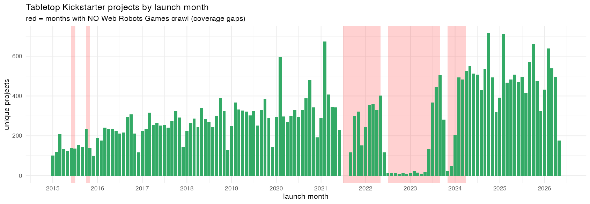

*All tabletop launches by month (board games included, not just RPGs), from the stitched-together monthly crawls. The red bands mark months where the **crawl** captured no Games category at all. These are crawl months rather than launch months, so the few projects still showing there were salvaged from much later crawls and badly undercount the real total. One such stretch coincides with the 2023 OGL crisis.*\
*Source: Web Robots crawl — all tabletop launches (board games included); survivors only.*

The first thing I checked was the success rate. The data said tabletop RPGs succeed about **98% of the time**. That looks wildly inaccurate, and it made me suspicious of the Web Robots data. Web Robots builds its snapshots from Kickstarter's public "discover" pages, and those pages overwhelmingly surface projects that are live or that succeeded. Campaigns that flopped quietly fall out of view and never make it into the crawl.[^survivorship] Any success rate computed from it describes the survivors rather than the full population.

This is survivorship bias, and it required a bit of additional thinking. It means there are two separate questions and they need different data:

1. **Did it get funded at all?** — You cannot answer this from a dataset with no failures.
2. **Given that it got funded, how much did it raise?** — This you *can* answer, because the survivors are exactly the population you care about.

So I looked for data that does include the failures. A widely-used Kaggle export covers 2009–2018 and includes the flops; an academic dataset from ICPSR covers 2009–2023 with all 610,000 Kickstarter projects, successes and failures alike.[^triangulation] Everything below triangulates across the three sources, using the failure-inclusive ones for "did it fund" and the rich Web Robots crawl for "how much."

:::notice
**The datasets behind this post** — which one is used is noted in each figure's caption.

- **Web Robots crawl** — RPG-specific (keyword-classified), but *funded projects only* (survivors, **no failures**), 2014–2026. Answers *how much* a project raises: the dollar figures, the genre/composition mix, and ZineQuest.
- **ICPSR 38050** — includes failures, 2009–2023, but covers *all tabletop* (board games included) because project names are masked, so RPGs **can't be separated out**. Behind the success-rate and funding-threshold figures.
- **Kaggle export** — includes failures *and* keeps names (so RPGs **can** be classified), but ends in early 2018. Behind the project-attribute funding model and the 5e event study.
- **Internet Archive (Wayback) reward tiers** — per-tier prices, backer counts, and (for 2017–2022 campaigns) the itemized contents of each tier, recovered from *archived* campaign pages, since Kickstarter's bulk data carries only campaign totals. A selected sample: the top decile of funded RPG books plus the rest of the top quartile for 2017–2022 (683 books, ~6,600 tiers), of which 415 books also have itemized tier contents. Behind the reward-tier ("whale"), deluxe-price, and bundle figures.

Rule of thumb: the *failure-inclusive* sources (ICPSR, Kaggle) answer "**did it get funded?**"; the Web Robots crawl answers "**how much did it raise?**" among those that did.
:::

With the failures back in, the tabletop success rate runs at about **two-thirds** over 2009–2018, climbing to roughly **86% by 2023**.[^rate] Note that this covers all tabletop products, boardgames included, because the ICPSR data do not allow me to subset to ttrpg products only. Tabletop has become one of the categories with the highest success rates, though it got there gradually.

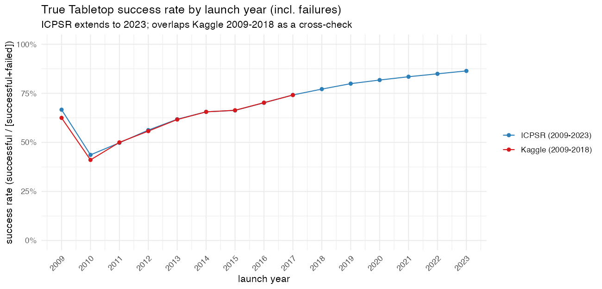

*The real success rate (successes ÷ finished projects), once you put the failures back in. Two independent datasets agree closely through 2018; the longer one runs on to ~86% by 2023.*\
*Source: ICPSR & Kaggle — all tabletop, including failures.*

## A growing share of gaming crowdfunding

First, a sense of scale: how big is this corner of Kickstarter, and is it growing? It has grown in most years. Across the funded dollars in Kickstarter's whole Games category, tabletop is far larger than the other subcategories, and the RPG share within it has risen steadily.[^market]

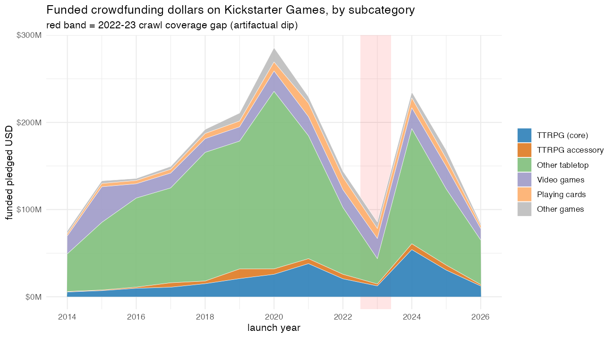

*Funded pledged dollars on Kickstarter's Games category, stacked by subcategory. Non-RPG tabletop (green, mostly board games) plus the RPG bands (blue core, orange accessories) at the bottom together dwarf video games, playing cards, and the rest. The red band is the 2022–23 coverage gap; the dip there reflects the missing crawls, not a real downturn.*\
*Source: Web Robots crawl — funded dollars, all Games subcategories.*

Let's take a closer look at ttrpgs only. On *cleaned* labels (after removing the board games, dice, and card games a keyword classifier had mistakenly filed under "RPG"[^cleanlabels]), core RPGs go from about **7% of Kickstarter-Games dollars** in the mid-2010s to the mid-to-high teens by the 2020s. The raw line touches ~24% in 2024, but that single year is strongly affected by the $15M Cosmere RPG campaign. Trimming the top 1% of projects pulls even 2024 down near 14%.[^market]

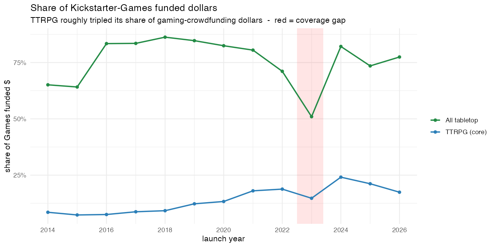

*Core RPGs' share of all Kickstarter-Games funded dollars (blue, cleaned labels), with tabletop's share overall (green) for context. Both rise; the RPG line roughly doubles, and the 2024 spike toward a quarter is one $15M megaproject. (The 2022–23 dip reflects the coverage gap.)*\
*Source: Web Robots crawl — funded dollars, RPG-classified (cleaned labels).*

But "tabletop" is mostly *board games* when it comes to dollars. Line up each subcategory's share of the money against its share of the projects and you can see where the big money sits: board games take about **60% of the dollars on 44% of the projects**, while the cheap commodities (playing cards, RPG accessories) are the reverse, lots of projects and little money. Core RPGs land in between, raising roughly in proportion to their numbers.

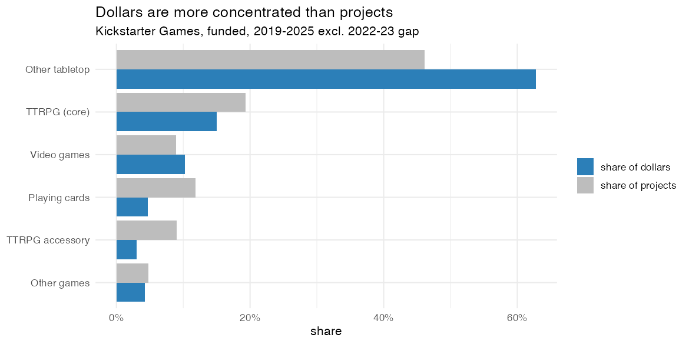

*Each subcategory's share of funded dollars (blue) vs its share of funded projects (grey). Where blue beats grey (board games, video games) is high-value territory; where grey beats blue (playing cards, accessories) is high-volume but cheap.*\
*Source: Web Robots crawl — funded projects, all Games subcategories.*

## The dollar distribution among funded projects

Among funded projects, the distribution of dollars is strongly top-heavy. The **top 1% of funded RPG projects capture about 34% of all the dollars**, and the top 5% capture nearly two-thirds. For accessories it is even more concentrated relative to their size, with the top 1% pulling in 38%. The whale post was studying the part of the distribution that holds most of the money.

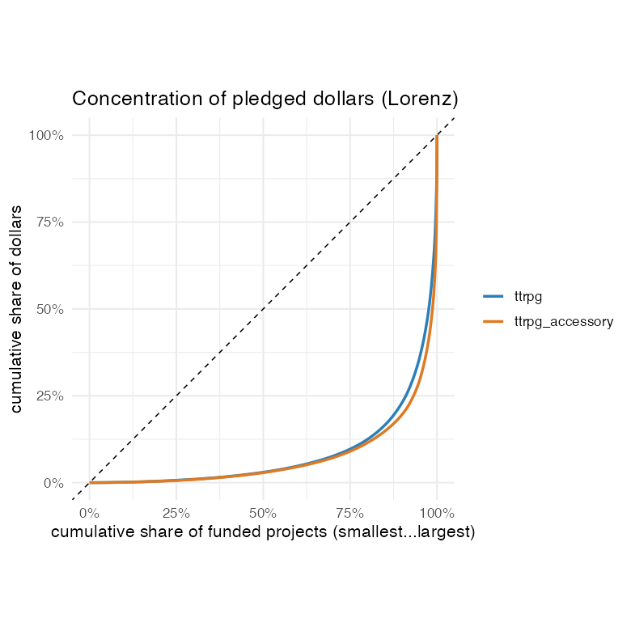

*How concentrated the money is. The sharp bend near the right edge means a tiny share of projects holds most of the dollars; a straight diagonal would mean perfect equality.*\
*Source: Web Robots crawl — funded RPG projects only.*

The typical project is far smaller. A median *funded* RPG book raises around **$5,800** from a bit over 200 backers; a median funded RPG accessory (dice, minis, a GM screen) raises about **$3,000** from roughly 100 backers. The per-backer pledge is nearly identical, about $30 either way, so RPG books pull ahead by attracting roughly twice as many backers rather than by charging more per pledge.

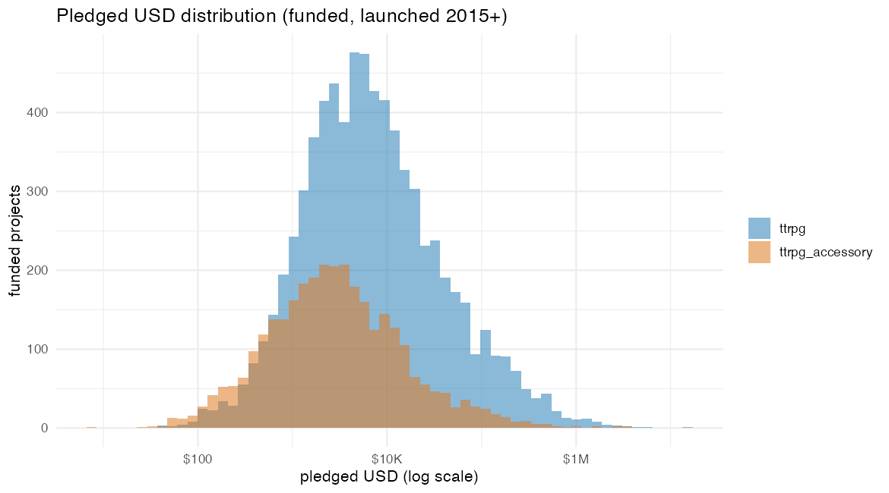

*What funded projects raise (log scale). RPG books sit to the right of accessories, meaning they raise more, but both distributions have a long tail reaching toward the millions.*\
*Source: Web Robots crawl — funded RPG books vs. accessories.*

Accessories set the bar lower. Their median funding goal is **about $400**, and they clear it comfortably: 86% of funded accessories raise at least double their goal, versus 76% for books. "Set a tiny goal and overfund" seems to be a common strategy.

## Market size, project size, and price changes

Every dollar figure so far, from the median raises to the ~$30 a backer chips in, has been nominal and lumped across a decade. Since the mid-2010s U.S. consumer prices have risen about a third, so a $10,000 raise in 2015 and a $10,000 raise in 2025 aren't the same achievement. Putting everything in constant 2025 dollars separates three questions: did the market grow, did the typical project raise more, and did the products themselves get cheaper?[^realterms]

The **market** grew, comfortably outpacing inflation. Total real dollars raised by funded RPG books roughly **tripled** between 2015 and 2025, a gain of about 220% against the ~36% that the cost of living rose over the same stretch. Almost all of that is volume: there are many more RPG-book campaigns now than a decade ago.

The **typical project**, by contrast, shrank. In constant dollars the median funded RPG book raised about **$10,800 in 2015 and only ~$4,400 in 2025**, a fall of nearly 60%, while the median per-backer pledge dropped from roughly **$56 to $29**. The median project and the median backer each put in about half what they did a decade ago, and both sit well below the inflation line for the whole back half of the decade.

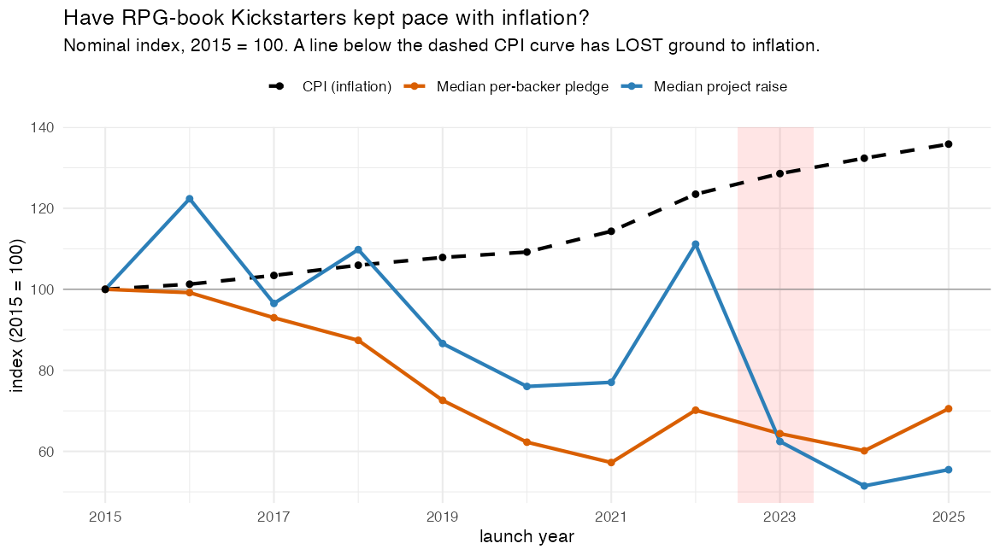

*Nominal index, 2015 = 100, for the median RPG-book raise (blue) and the median per-backer pledge (orange), against the CPI inflation curve (dashed). A line below the dashed curve has lost ground to inflation; both have, steeply, since about 2018–19. The red band is the 2022–23 coverage gap.*\
*Source: Web Robots crawl (funded RPG books) + BLS CPI-U annual averages.*

Is this drop driven by cheap zines entering the Kickstarter market and dragging the median down? Partly, but not completely. ZineQuest (from 2019) did pull in a flood of cheap zines, and dropping them lifts the median a little, though not by much: among **non-zine** books the real per-backer pledge still dropped about 45%, and within the subcategory of books that **name D&D 5e** it dropped about 56% (with the real raise down 62%). Excluding the cheapest type of project doesn't change the picture, so this is more than a compositional effect.

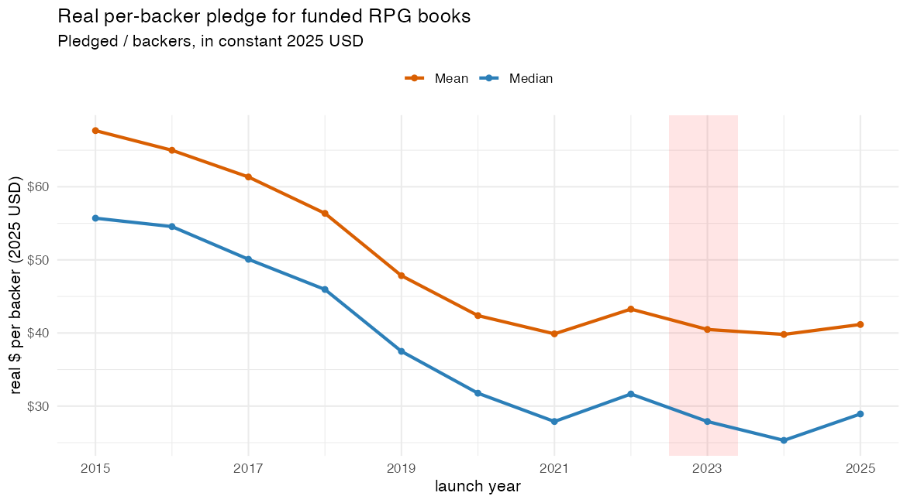

*Median per-backer pledge in constant 2025 dollars, for all core books, non-zine books only, and D&D 5e–named books. All three fall together, so the decline is not just the cheap-zine mix.*\
*Source: Web Robots crawl — funded RPG books, CPI-adjusted.*

So if even comparable books raise less per backer, did the **products themselves** get cheaper? No. The archived campaign pages behind the whale-tier section near the end of this post let me follow the price of a given product over time, and those prices barely budge in real terms: the cheapest **digital/PDF** tier holds around $25, the standard **hardcover** around $50, and the **deluxe** edition around $100, all in constant 2025 dollars, none drifting down.[^deluxe] A hardback RPG book costs about what it always did, once you adjust for inflation.

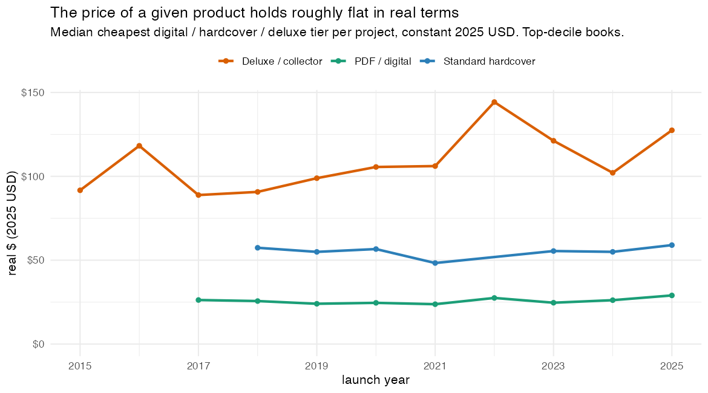

*Median price of the cheapest digital, hardcover, and deluxe tier per project, in constant 2025 dollars. Each product type is roughly flat across the decade; read the levels rather than the year-to-year wiggles. Recovered tiers, top-decile funded RPG books only.*\
*Source: Wayback-recovered reward tiers, CPI-adjusted.*

I think this points to a shift in the market rather than in prices. Any given tier held its real value, but the typical project still raised less, because campaigns now spread their backers across more and cheaper tiers (a $1–15 PDF, an entry pledge below the hardback), and because more, smaller projects launch every year. A campaign with a hardback option now also reaches a much broader base of cheap-tier backers, which pulls the average outlay down even as the hardback's own price holds. So at the population level the average RPG product is cheaper, but that is composition: cheap formats like zines and PDF-only releases proliferated, and backers can now commit fewer real dollars on a pledge. Creators have set their asks to match, and the goals they choose have fallen even faster in real terms, which I come back to below.

## Goals and campaign length

Two numbers a creator picks before anything else are the **goal** (how much to ask for) and the **clock** (how long to run). RPG goals cluster in the low thousands, with accessories a notch lower in the hundreds, and there are spikes at round numbers like $1,000 and $5,000.

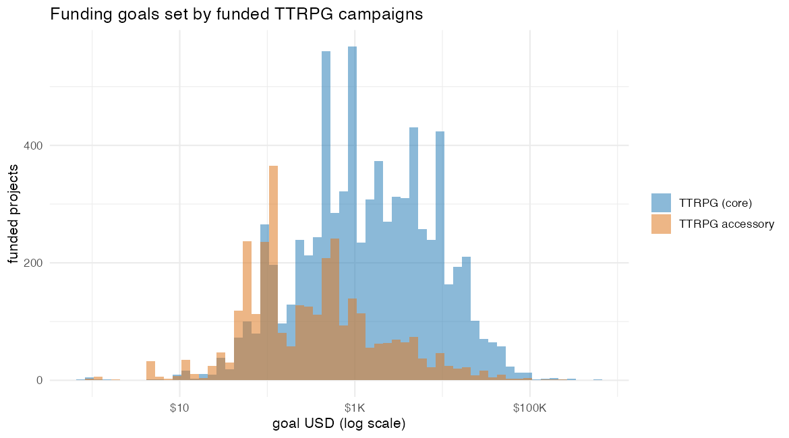

*Goals set by funded campaigns (log scale). Core RPG books cluster around $1–5K; accessories sit lower. The vertical spikes are round-number goals.*\
*Source: Web Robots crawl — funded RPG projects only.*

Goals have fallen markedly over the decade. The median funded RPG book asked for about **$4,000 in 2016 and only ~$600 by 2024**; accessories fell more steeply, from ~$2,500 to about $100. Part of this is the zine wave, since small-format projects with tiny goals became common after 2019, and part is creators gravitating to a modest, beatable goal as the safe default.[^goaltrend]

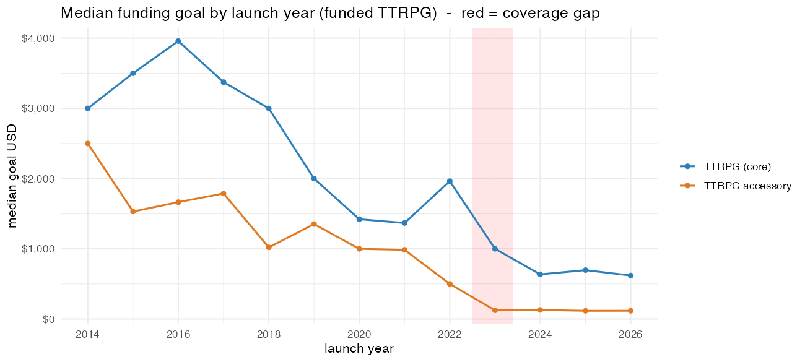

*Median goal by launch year (funded only). Goals more than halved over the decade, with the post-2019 slide tracking the influx of small-goal zines.*\
*Source: Web Robots crawl — funded RPG projects only.*

The real decline is steeper than the nominal one. Deflated to constant 2025 dollars, the median goal slid from about **$4,100 in 2015 to under $700 in 2025**, an **~83% real fall**: today's typical creator asks for roughly a sixth of the real money their 2015 counterpart did. The modest-goal habit and the zine format, which needs almost nothing to clear, have pushed the ask down faster than the nominal figures let on.[^realterms]

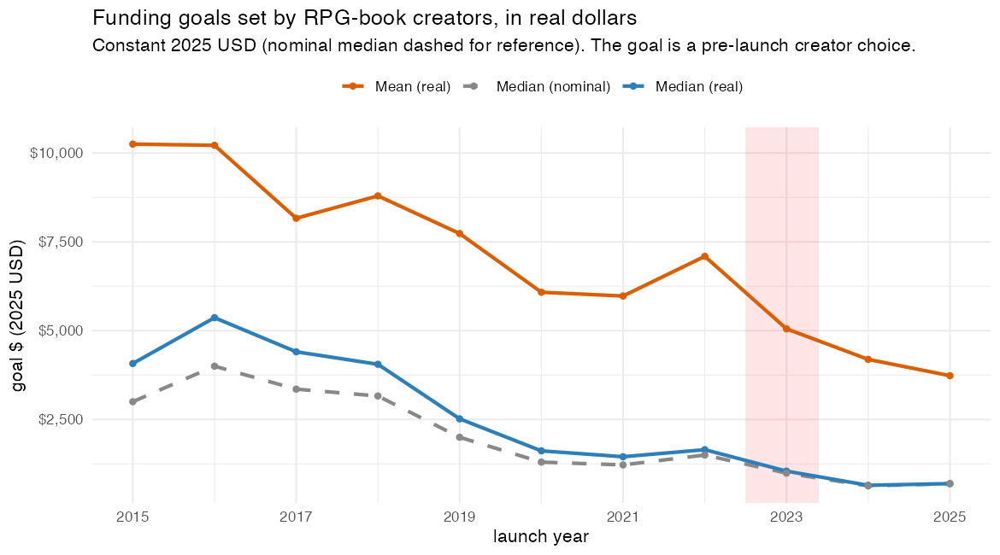

*Median funded RPG-book goal by launch year, in constant 2025 dollars (mean in orange; the faded dashed line is the nominal median). Even after stripping out inflation, the typical goal fell to about a sixth of its 2015 level.*\
*Source: Web Robots crawl (funded RPG books) + BLS CPI-U.*

The clock varies far less. The overwhelming majority run the platform's **30-day default**, with smaller clusters at two and three weeks and almost nobody past 60 days.

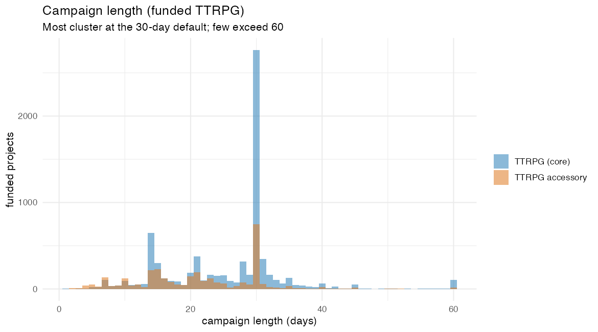

*Campaign length in days (funded). The spike at 30 is Kickstarter's default; few creators stray far from the common two-to-four-week window.*\
*Source: Web Robots crawl — funded RPG projects only.*

## The shift toward D&D 5e

Before asking what succeeds, it helps to look at what people make and how that has changed. Over the decade the mix of funded RPG books shifted substantially. Books that name **D&D's fifth edition** went from about **7%** of funded RPG books in 2014–15 to nearly **40%** by 2023–26. The old-school renaissance (OSR) more than doubled its share. The long tail of titles that name no system receded as more creators hitched their book to a recognizable engine, and Pathfinder shrank in relative terms as 5e came to dominate the hobby.[^composition]

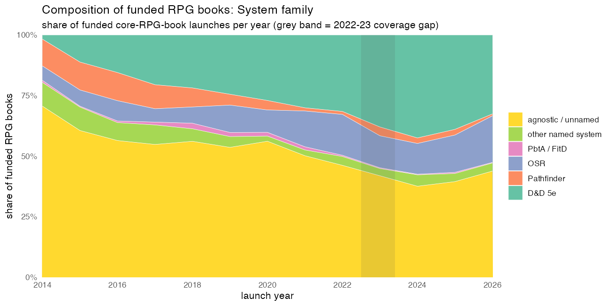

*The shifting mix of funded RPG books by system. The D&D 5e band (top) grows from a sliver to ~40%; OSR grows; the "agnostic / unnamed" base shrinks as books increasingly name a system. The grey band is the 2022–23 coverage gap.*\
*Source: Web Robots crawl — funded RPG books only.*

But "a 5e book" and "an indie-system book" are usually different *kinds* of objects:

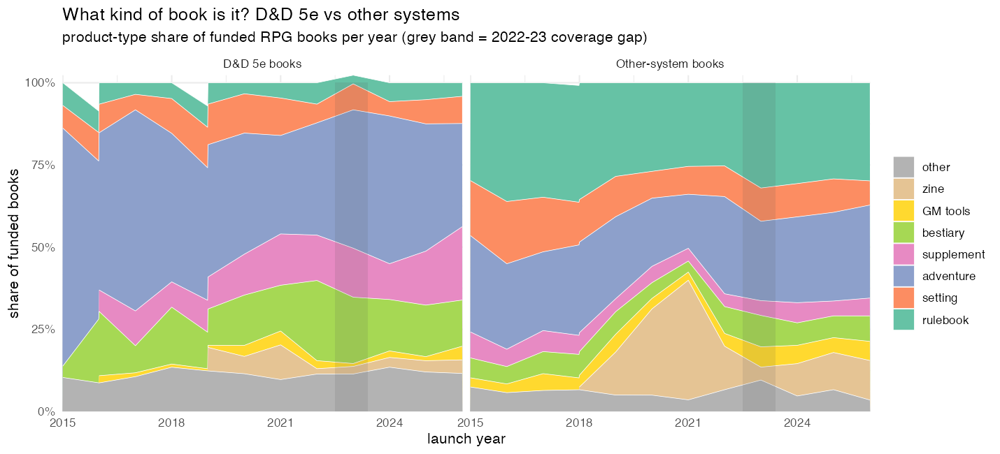

*What kind of book is it? D&D 5e books (left) versus everything else (right). 5e is mostly adventures and supplements; other systems are where new rulebooks and zines live.*\
*Source: Web Robots crawl — funded RPG books only.*

D&D 5e is something people publish *for*: about **40% of 5e books are adventures**, another quarter are bestiaries and supplements, and only ~6% are new core rulebooks. Other systems are where new games live, with about a third of them rulebooks, and they are also where the zines cluster (12% of other-system books, versus ~4% of 5e ones).

## What predicts getting funded: the creator more than the project

This is the question the survivor data cannot answer. Using the failure-inclusive datasets, I asked Claude to build models to predict funding success and checked how well they did out-of-sample rather than how well they fit in-sample.[^auc] One thing to keep in mind for this whole section: the failure-inclusive data is either name-identified only through 2018 or not RPG-specific. Because the Kaggle export keeps project names, I *can* run the keyword classifier on it and isolate RPG projects, but only through 2018; ICPSR masks names, so it stays whole-tabletop. The funding-side story therefore leans on tabletop crowdfunding in the 2010s and may not perfectly describe the ZineQuest-era RPG market of the 2020s.[^fundingera]

I started with two models with different kinds of information. One knew only about the **creator**: how many projects they'd run before, how many succeeded, how many failed. The other knew only about the **project**: its genre, its goal, its country, its title.

The creator model came out ahead, with an AUC of about **0.83** against the project model's **0.72**.[^whovwhat] The two models are built on different datasets, though (only one source pairs creator IDs with failures, only the other carries project names), and the creator-history model isn't even RPG-specific, so this is a decomposition across sources rather than a head-to-head on the same projects. Read with that caveat, the finding points one way: *who is asking* looks at least as predictive as *what they're asking for*. A creator's prior track record is the strongest single predictor I found. Each past success multiplies the odds of funding, a strong prior success rate multiplies them a good deal more, and past failures predict future failure in the same way.

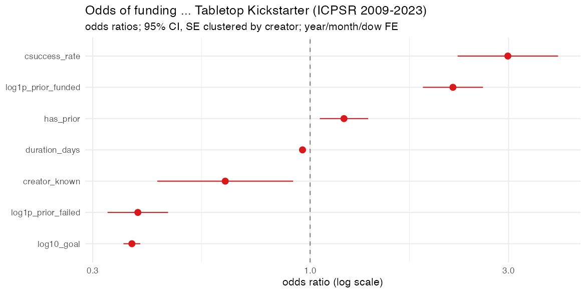

*What predicts getting funded, from the creator-history model (odds ratios). Bars to the right of 1 improve the odds, with a strong prior success rate helping most; prior failures sit to the left of 1 and drag the odds down.*\
*Source: ICPSR — all tabletop, including failures (not RPG-specific).*

This also explains the rising success rate. As the platform ages, a growing share of launches come from people who've done it before and succeeded. The market may not have become easier; rather, the pool of creators became more experienced.

You can see it in the descriptive data as well. Splitting each year's RPG launches into first-timers and creators we've already seen, the returning share climbs from almost nothing in the early years to roughly half by the 2020s.

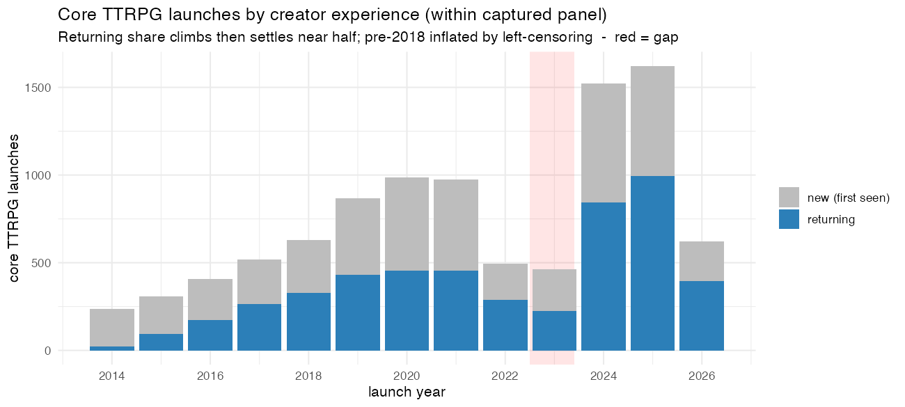

*Each year's core RPG launches, split into creators making their first appearance (grey) and those seen in an earlier year (blue). The returning share grows as the scene matures. The earliest years are mechanically low, though: with the data starting in 2014, nobody can be "returning" at first.*\
*Source: Web Robots crawl — RPG launches in the crawl (survivors).*

The project attributes still matter, just less. Holding other things equal: an actual RPG is more likely to fund than a board or card game; a "5E-compatible" or D&D/Pathfinder label helps further; US-based projects do a bit better.[^rpgonly] And there is the familiar Kickstarter finding that **modest goals fund more reliably**. Each tenfold increase in the goal cuts the odds of funding by roughly two-thirds.

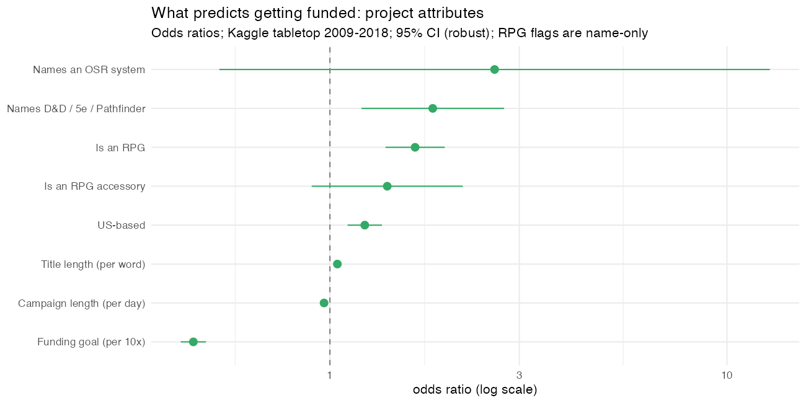

*The "what" counterpart to the creator plot above: project-attribute predictors of getting funded (odds ratios; right of 1 helps, left of 1 hurts). Naming an RPG, carrying a D&D/5e label, and being US-based lift the odds; a larger goal sharply lowers them. This is a different model on a different dataset (Kaggle, which has names but no creator history), so read it alongside the creator plot rather than coefficient against coefficient.*\
*Source: Kaggle — RPGs vs. other tabletop, including failures (ends 2018).*

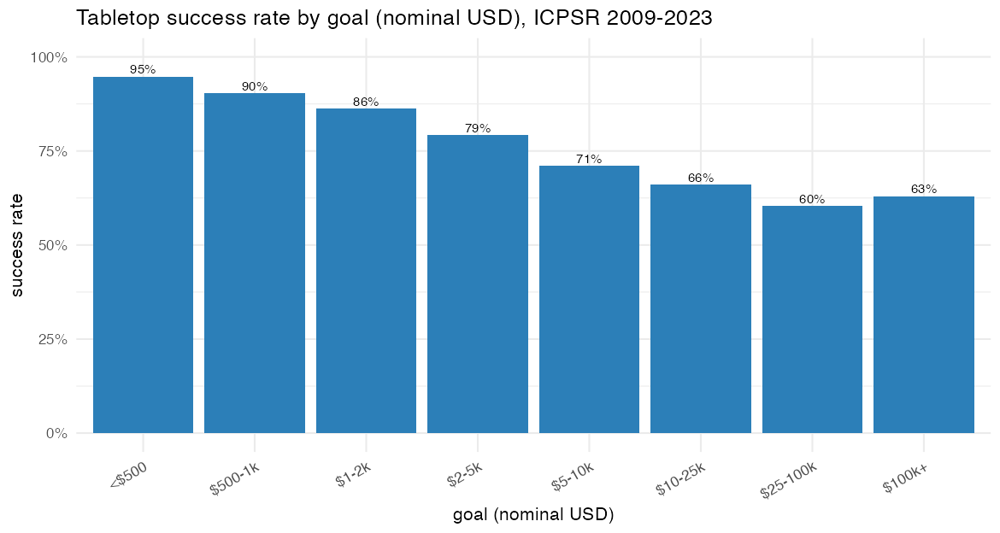

*Success falls steadily as the goal climbs. But read this as "who sets what" rather than as a lever: cautious creators with small audiences are the ones choosing the small goals.*\
*Source: ICPSR — all tabletop, including failures.*

A warning on that last one, because it's an easily misunderstood statistic: this is a correlation, and the goal is not randomly assigned. Creators set goals in anticipation of demand. A cautious creator with a small audience sets $2,000; a publisher with a big mailing list confidently sets $80,000. So "low goals succeed more" does **not** mean "lower your goal and you'll succeed." The number tells you which kind of creator picks which kind of goal; what would happen if a given creator trimmed their own is a question it cannot answer. (I return to this point below.)

## Among funded projects, what correlates with the size of the raise

For the magnitude question, meaning how big a funded project gets, I switched back to the rich Web Robots data, which is the funded population. The standouts, expressed as "multiply the dollars by roughly":

- **A Kickstarter staff pick ("Projects We Love"): ×2.6.** By far the strongest factor in the list.
- **A repeat creator: ×1.4.** The backer-base premium again.
- **Having a video: ×1.13.** Modest but real, though measurable only on recent campaigns.[^video]
- **Being a zine: ×0.73.** Zines are small by design.

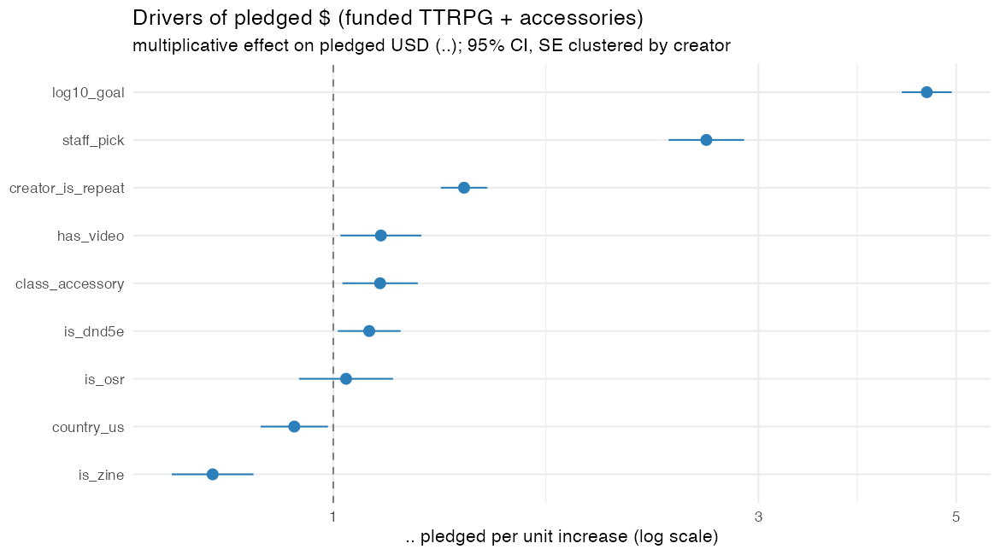

*Correlates of raising more, among funded projects: multiply the dollars by the value on the axis. A "Projects We Love" staff pick travels with ~2.6× the money; a zine, with less.*\
*Source: Web Robots crawl — funded RPG projects only.*

I'm deliberately leaving the funding goal off that list even though it has the largest coefficient, because for funded projects its effect is mostly **mechanical**: if you raised enough to succeed then you cleared your goal by definition, so a bigger goal sets a higher floor.[^goal]

Two further points. First, I fed each campaign's text, meaning titles and blurbs, into the model, restricting it to books. In the pooled book-plus-accessory sample, physical-product words like "miniatures" and "scenery" mostly flag the accessory class rather than any wording effect. The text adds only modestly to predictive power, and the strongest individual terms double as a caution about the method: several are **brand and series names** (*Mothership*, *Forbidden Lands*, *Root*, *Dimgaard*) that a bag-of-words model memorizes as "these named lines did well" without the lesson generalizing to a new project.[^text] What does generalize is duller. Naming a **physical print format** predicts a larger raise: books that mention a binding raise well above the PDF-only and zine baseline (hardcover most, ~$25k median; softcover ~$13k; neither ~$6k), so the word marks a printed object rather than a deluxe one. Advertising **broad system compatibility** helps too, since blurbs that enumerate several compatible systems ("…AD&D, 5e, DCC, Pathfinder, OSR…") reach a wider audience. At the other end, "pay what you want," "one-shot," and "online" framing predicts raising less, which is the small-format, give-it-away end of the market.

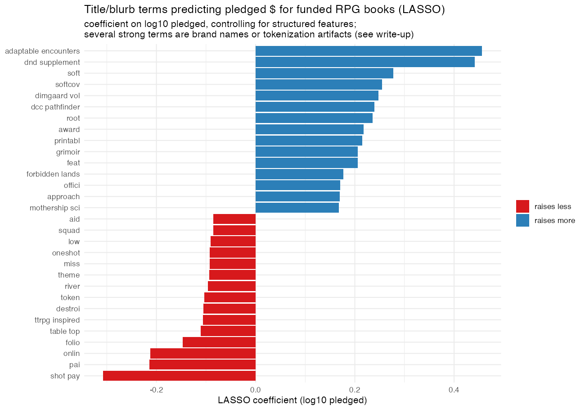

*Title/blurb terms predicting how much a funded RPG **book** raises (LASSO, controlling for the structured features). Read with care: several of the strongest "raises more" terms (blue) are brand/series names the model has memorized, or tokenization artifacts. "dcc pathfinder" is two adjacent items in a system-compatibility list, and "softcov" marks a printed book rather than a premium binding. The generalizable signals are naming a print format and broad system compatibility; "pay-what-you-want" and one-shot framing (red) predict less.*\
*Source: Web Robots crawl — funded RPG books only.*

Second, the staff-pick and video effects get stronger the further up the distribution you go. For a median project a staff pick is worth maybe 1.5×; for the runaway hits near the top it's associated with more like 3.5×. Social proof and production polish seem to be amplified in the upper tail. (Correlation again: Kickstarter may hand out staff picks to projects it can already tell will be big. Still, it's a suggestive pattern.)

### Books that name a system tend to raise more

Since I'd tagged every book by its system, I could ask a sharper version of the old "5E helps" folk wisdom: among funded books, does naming a recognized engine correlate with more money? Relative to a system-agnostic book, naming a known system is worth a roughly **25–45% bigger raise**, with D&D 5e at ×1.32, OSR at ×1.26, and the named indies (Call of Cthulhu, Mothership, and similar) at ×1.43. Pathfinder and the PbtA family are statistically indistinguishable from agnostic.

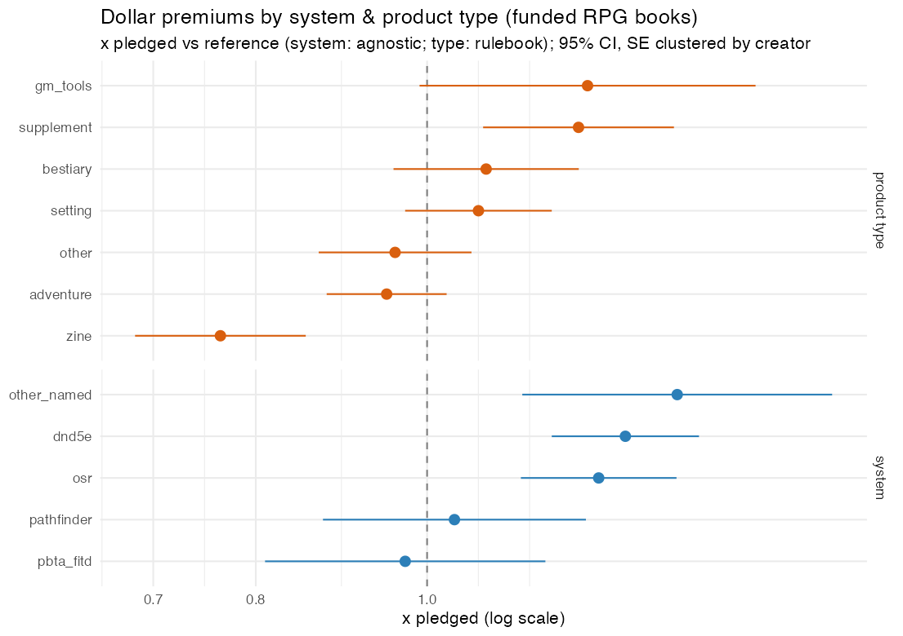

*Multiply-the-dollars premiums for funded RPG books, versus a system-agnostic rulebook. Naming a recognized system (blue) pays; product type (orange) matters less, except that zines raise less.*\
*Source: Web Robots crawl — funded RPG books only.*

In the failure-inclusive data, books that name a recognizable system are also meaningfully more likely to **get funded at all**. Naming a system seems to reassure backers that an audience already exists for the thing. That said, all of this is second-order: adding the system and product tags barely changes how well the model predicts dollars, and goal-setting, reputation, and the staff pick remain the dominant predictors.[^sysprem]

## Where books and accessories diverge

Because I'd split RPG books from RPG accessories, I could ask whether they respond to the same things. They mostly do, with one asymmetry.

For **how much you raise**, the drivers differ. The clearest example is that a "5E-compatible" label raises money for a rulebook but is slightly negative for an accessory.[^bookacc] That makes intuitive sense: a branded D&D *book* is a selling point, while generic "D&D dice" or "D&D minis" are a commodity in a crowded field. Being US-based flips sign too.

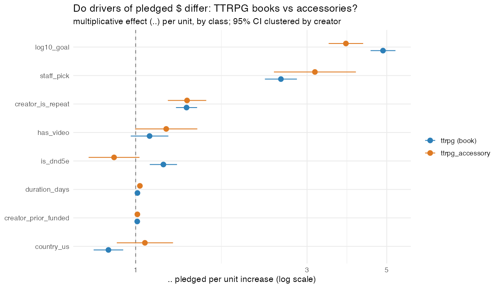

*Same drivers, different products. The book effect (blue) and accessory effect (orange) pull apart, most visibly for the 5E label, which lifts books but not commodity minis.*\
*Source: Web Robots crawl — funded RPG books vs. accessories.*

For **whether you get funded**, though, the drivers don't meaningfully differ between books and accessories. The things that get you across the funding line (a modest goal, a reasonable campaign length, an established creator) seem to work about the same regardless of what you're selling. Product type shapes how much you raise, then, but not whether you raise it.

## Did 5e cause the boom?

It is tempting to credit the rising RPG fortunes of the last decade to obvious cultural events: 5th edition in 2014, *Stranger Things*, *Critical Role*. That is hard to show in the data.

The usual way to test "did event X cause the RPG surge" is a difference-in-differences: compare RPGs (which event X should affect) against board and card games (which it shouldn't) before and after, so the platform-wide trend cancels out. When I do this for **5th edition's mid-2014 release**, the result is a null. The RPG advantage over other tabletop games was already present in 2012, two years before 5e shipped, and it continued afterward. There is no break at the release.[^did5e]

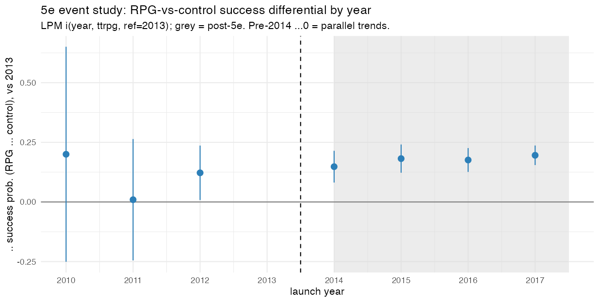

*The 5e effect that does not appear. The RPG-vs-control success gap is already positive in 2012 and flat across the mid-2014 release (dashed line). No jump, and no causal story.*\
*Source: Kaggle — RPGs vs. other tabletop, including failures (ends 2018).*

The ttrpg boom is real, but pinning it on 5e specifically doesn't seem to be supported in the data. The treatment was too gradual and too anticipated, and 5e probably lifted D&D *board games* too, contaminating the comparison. *Stranger Things* and *Critical Role* are even harder to test cleanly, so I won't try.

The 5e test came up empty, but one effect does show up clearly in the raw data. Sort core RPG launches by calendar month and one month departs from the pattern, though only recently. Through 2018, February was unremarkable; from 2019 on it rises to more than **a fifth of the whole year's launches**.

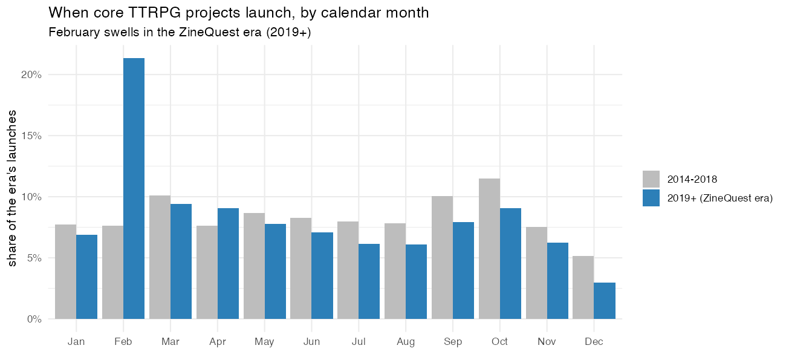

*Share of core RPG launches by calendar month, split into 2014–18 (grey) and 2019+ (blue). February rises from an ordinary ~7–8% to ~21% in the later period.*\
*Source: Web Robots crawl — RPG launches in the crawl (survivors).*

That February bump is **ZineQuest**, Kickstarter's annual February push for RPG zines, launched in 2019. Unlike the diffuse 5e rollout it is sharp enough to test, and it is closer to a natural experiment because it is RPG-specific: Kickstarter promotes RPG zines and not board games, so board games make a usable control group. The effect is large. Funded RPG launches **roughly double every February** in the ZineQuest era, relative to what the season and the trend would predict, with no such jump beforehand.[^zinequest] The mechanism is narrow. ZineQuest worked through volume, drawing a large number of small zines that would not otherwise have launched while leaving the size of the typical project unchanged. The February cohort is 41% zines (versus 3% the rest of the year), and its median pledge is less than half the usual. The program lowered the barrier to small-format publishing and many creators took it up, which is what it was for. One threat I can't fully dismiss is that the data captures the projects Kickstarter promotes, and ZineQuest is itself a promotion push, so some of the February jump could be promoted zines becoming more visible to the Web Robots crawl rather than more numerous. The board-game control soaks up platform-wide visibility shifts but not one aimed specifically at RPG zines, so I'd treat the exact size of the effect as suggestive even though its existence is hard to explain away.

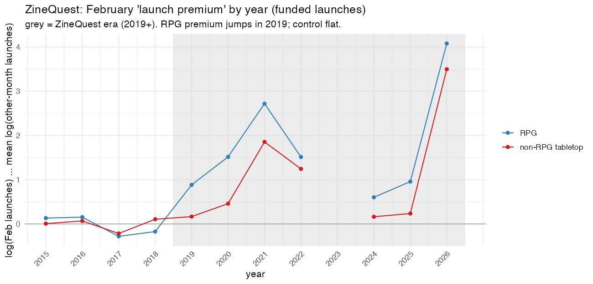

*The ZineQuest effect. The February "launch premium" for RPGs (blue) is flat before 2019, then rises when the program starts and stays elevated, while the board-game control (red) does not.*\
*Source: Web Robots crawl — funded RPG launches vs. board-game control.*

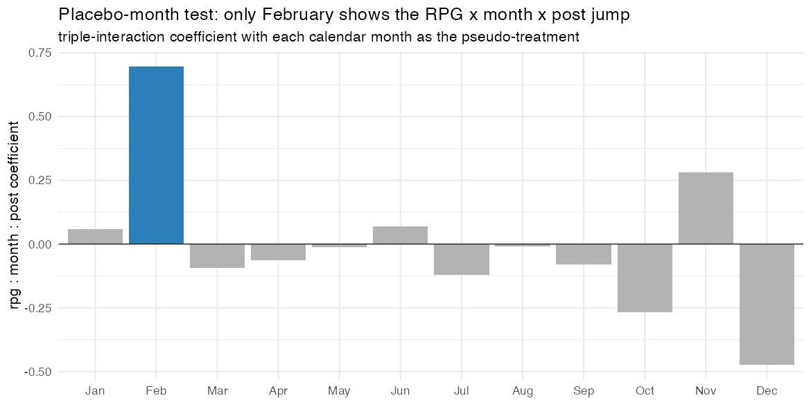

*A placebo check: re-run the test pretending each month is the "treatment." Only February (highlighted) shows the jump, which is good evidence the effect is ZineQuest rather than noise.*\
*Source: Web Robots crawl — funded RPG launches vs. board-game control.*

### The funding threshold doesn't work as an experiment

A final causal design is a regression discontinuity at the funding goal. Kickstarter is **all-or-nothing**: reach 100% of your goal and you collect the money; finish at 99% and you get nothing. Two campaigns that end at 99% and 101% are, in terms of underlying demand, nearly identical, yet one is "funded" and one is not. That sharp line looks like a natural experiment: line up the just-funded against the just-missed and ask what getting funded does to a creator's future. Do they come back and launch again?

For Kickstarter projects, this does not work. When I plot where projects actually land relative to their goal, there are very few just below the line and many just above it: in the failure-inclusive data only **94 projects** finished in the 90–100% band, against **1,373** in 100–110%.

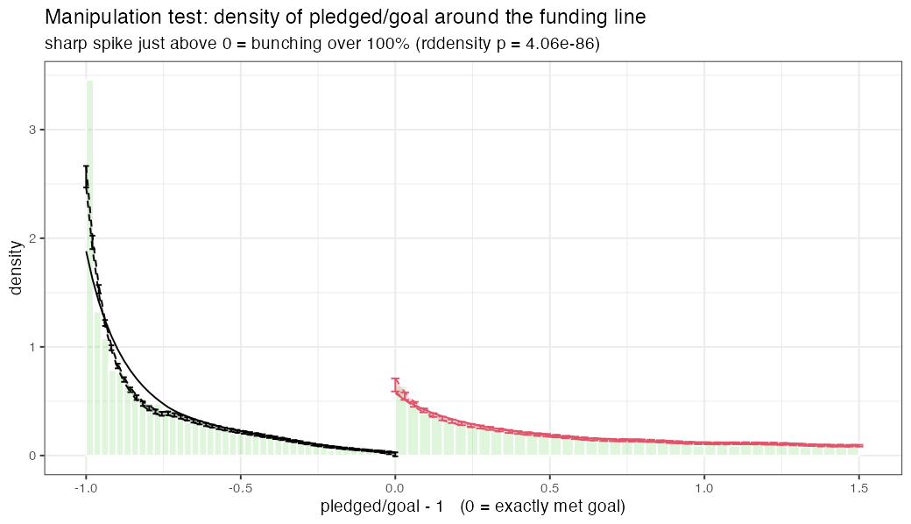

*The manipulation test. If 100% were a clean dividing line the density would be smooth across it; instead it jumps, because near-misses get pushed over and almost nobody ends* just *short.*\
*Source: ICPSR — all tabletop, including failures.*

This is **manipulation at the threshold**, and it is benign: as a campaign nears its goal in the final days, the creator and their friends push it over, and last-day momentum carries it across. It still invalidates the design, because the projects sitting just above the line are not interchangeable with the ones just below; they are the ones that managed to cross. The naive "effect of funding" is correspondingly fragile, sizable under one specification and gone under a slightly different one. Setting the causal design aside, the descriptive relationship still tells you something: the more a campaign raises relative to its goal, the more likely the creator is to launch again, with no discontinuity at the threshold itself.[^rd]

I would also have liked to study the **2023 OGL crisis** (Wizards of the Coast's botched attempt to revise the Open Game License, which alarmed many RPG creators) as a shock to the system. I cannot: the Web Robots crawl has a coverage gap that coincides with January 2023, and the only failure-inclusive source that reaches that far masks project names, so I cannot identify the RPGs.[^ogl]

## Back to the whale tiers

The whale post's question, how the money splits across a campaign's reward tiers, is the one I began without the data to answer: tier-level prices and backer counts appear only on individual campaign pages, not in any of the bulk datasets. So I went back and recovered them (with the help of Claude), reading the *archived* campaign pages from the Internet Archive's Wayback Machine rather than scraping Kickstarter directly.[^tiers] I did this twice: first for the top decile of funded RPG books, and then, because the whole point of this exercise is to get away from looking only at the winners, for the rest of the top quartile as well. That gives **683 books and about 6,600 tiers**, from campaigns raising anywhere between roughly $19,000 and $15 million. The sample is still selected and the figures are approximate: per-tier price × backers recovers about three-quarters of each project's total, the rest being over-pledges, add-ons, and shipping.[^tierframe]

The broad shape matches the whale post. The cheap tiers draw most of the backers and the premium tiers hold most of the money: across all 683 books, tiers under $25 take about a fifth of the backers but **4% of the dollars**, while the $100–500 band holds a fifth of the backers and **half the dollars**.

That pooled number, though, is the thing worth being careful about, because it is an average across campaigns of wildly different sizes and it is not true of any of them in particular. Split the books by what they raised and the premium tiers' importance climbs steadily with the size of the campaign. For books raising over $250,000, the $100–500 tiers supply **63%** of the money. For a book raising under $50,000 — which is most funded RPG books — they supply **20%**, and the sub-$50 tiers that barely register for the megaprojects carry a third of the total.

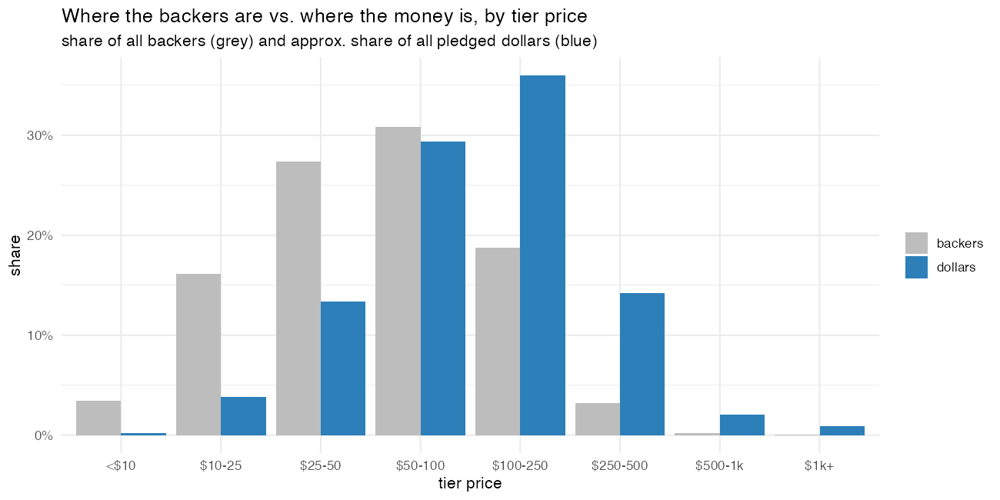

*Every reward tier sorted into price bands: share of all backers (grey) vs. approximate share of all pledged dollars (blue). Backers cluster at $50–100; the dollars shift right to the $100–500 premium tiers.*\
*Source: Wayback-recovered reward tiers — funded RPG books.*

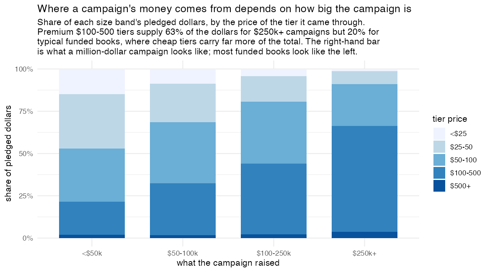

*Where each size band's pledged dollars came from, by the price of the tier that carried them. The premium band grows from a fifth of the money for typical funded books to nearly two-thirds for the largest campaigns. The right-hand bar is what a million-dollar campaign looks like; most funded books look like the left.*\
*Source: Wayback-recovered reward tiers — funded RPG books.*

The RPG-book "whale" sits lower than in the original post. Defined the same way, as the single most-expensive tier in a campaign, the median top-priced tier across these books is about **$300**, versus **$478** among the million-dollar megaprojects. That ceiling tier isn't where the money is made: the **highest-grossing tier of the median book is only about $65**. The expensive tier exists, but few people buy it, and that holds at every size — the top-priced tier collects about 4–6% of its campaign's money whether the campaign raised $30,000 or $3 million.

The tier that does the earning is not a fixed price either. It rises with the campaign, from about **$50** for books under $50,000 to **$127** for those above $250,000. In every band it lands close to what a printed copy of that book costs, which suggests the "sweet spot" is less a psychological price point creators should aim for than simply the tier with the physical book in it. Looking only at the largest campaigns would suggest a single figure near $100; across the category it is a moving target.

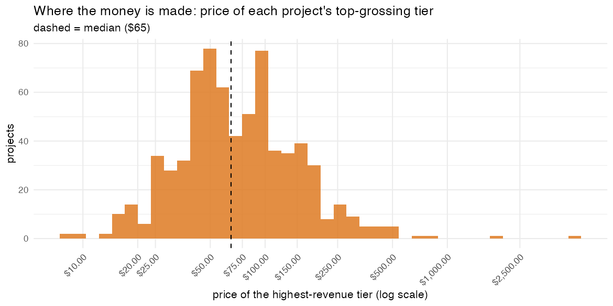

*The price of the single highest-revenue tier in each project, pooled across all sizes (median, dashed), far below each book's own most-expensive tier.*\
*Source: Wayback-recovered reward tiers — funded RPG books.*

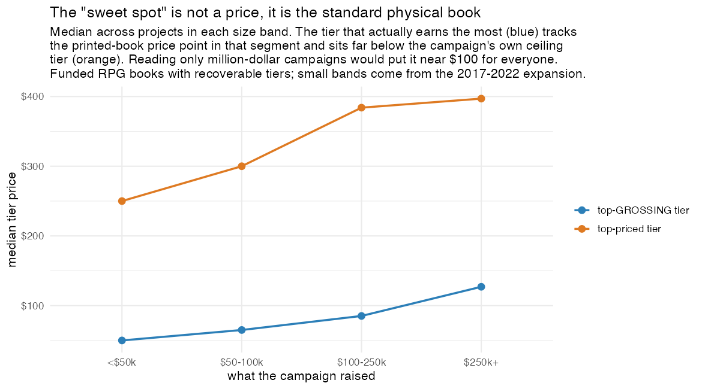

*Median top-priced tier (orange) and median top-grossing tier (blue) in each size band. The earning tier tracks the printed-book price point for that segment; the ceiling tier is roughly flat and always far above it.*\
*Source: Wayback-recovered reward tiers — funded RPG books.*

Nor is the money concentrated in one ceiling tier. The median book offers eight tiers, and its single highest-priced tier accounts for about 5% of its money. The dollars come from the mid-priced premium tiers rather than the most expensive ones.

One cautious note on whether tier design tracks raising more: projects that earn a larger share of their revenue from the high-end tiers do raise much more overall, but that is largely mechanical, since a big campaign has whales because it is big. The number of tiers barely matters, and a high ceiling price on its own, holding the whale share fixed, is if anything slightly negative.

### What is actually in the expensive tiers

Price is a crude stand-in for the thing people mean by a whale tier. The folk theory is not just that the tier is expensive but that it is *stuffed*: the book plus dice, plus minis, plus a GM screen, plus a map pack. Kickstarter's older campaign pages list the contents of each tier explicitly, under an "Includes:" heading, so for part of the sample I can count what a tier actually contains rather than inferring it from the price.[^bundles] That gives two measures per tier: the number of items listed, and the number of distinct *kinds* of accessory (dice, minis, maps, GM screens, cards and tokens, art and merchandise, apparel, other physical goods), counting the book itself and digital extras as neither.

The first thing this shows is that the premise is shaky. Bundles do get broader as tiers get more expensive, but the growth stops around $100. A $100–250 tier lists a median of 6 items spanning about 0.9 accessory categories; a $500-plus tier lists 7 items across 1.2 categories. The expensive tiers are not meaningfully more stuffed than the mid-premium ones. They are mostly just more expensive.

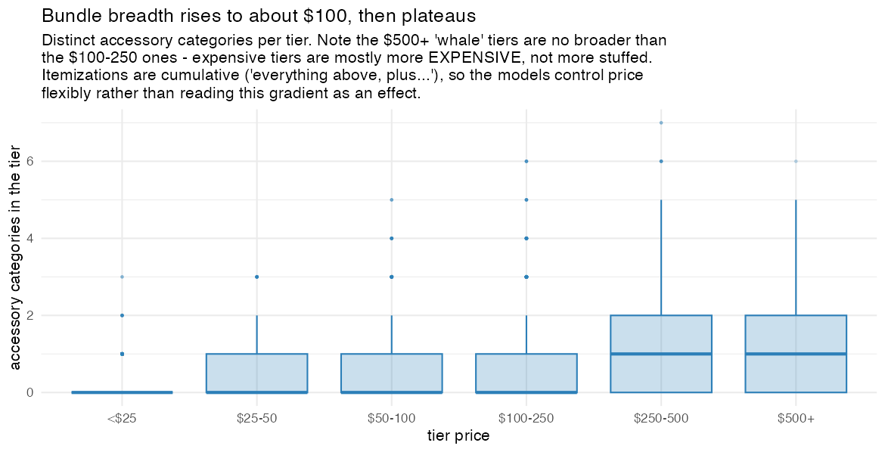

*Distinct accessory categories per tier, by price band. The climb flattens above $100: the $250–500 and $500+ bands look alike. Kickstarter itemizations are cumulative ("everything above, plus…"), so the models below control for price rather than reading this gradient as an effect.*\
*Source: Wayback-recovered reward tiers, itemized subset, funded RPG books 2017–2022.*

Comparing tiers *within* the same campaign, holding price fixed, backers do prefer a fuller tier. Each additional item listed goes with about **18% more backers** on that tier. What they are responding to is the raw count. Once the number of items is held fixed, the number of distinct accessory categories adds nothing: the estimate is +0.002 in log10 units, and it changes sign between subsamples. Variety of contents seems to carry no weight of its own once you know how much is in the box.

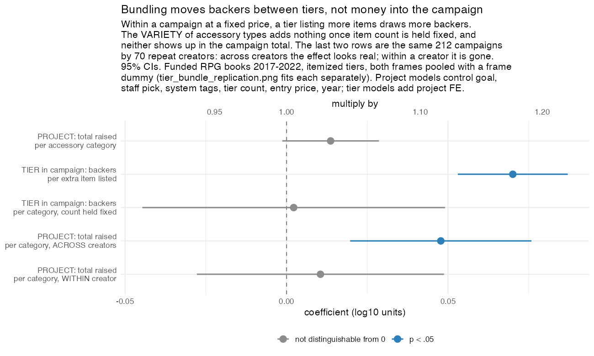

*Effect of one more item, and of one more accessory category, on the backers a tier attracts and on what the campaign raises overall. Within a campaign, more items pulls backers to that tier; variety does not, and neither shows up in the campaign total.*\
*Source: Wayback-recovered reward tiers, itemized subset, funded RPG books 2017–2022.*

None of this reaches the campaign total. A project whose richest tier spans more accessory categories does not raise more than one whose does not, in either half of the sample: the estimate is +0.004 among the biggest books (*p* = 0.78) and +0.013 among the smaller ones (*p* = 0.09). What bundling appears to do is move backers between a campaign's own tiers rather than bring additional money in. That is the same conclusion the price-only analysis reached, now from the contents rather than from a proxy.

The sharpest version of the test uses creators who ran more than one campaign in the sample, 70 of them across 212 campaigns. Comparing those campaigns to each other, heavier bundling does look like it pays: about 12% more per accessory category, comfortably significant. Comparing each creator against their *own* other campaigns, it disappears, to +0.011 with a confidence interval running from ×0.94 to ×1.12.[^creatorfe] The cross-sectional version was picking up the difference between creators who bundle and creators who do not, which is mostly a difference in the size of the audience they already had. For a given creator deciding what to put in a $250 tier, the evidence does not support bundling as a lever.

I am more confident in it than I would otherwise be, because the tier-level result was tested out of sample. The specification was fixed on the original sample of large books, and then applied unchanged to a second, separately collected set of smaller campaigns. The item-count effect holds in both (×1.23 among the large books, ×1.15 among the smaller ones); the accessory-variety effect flips sign between them, which is what a null looks like.[^bundlereplication]

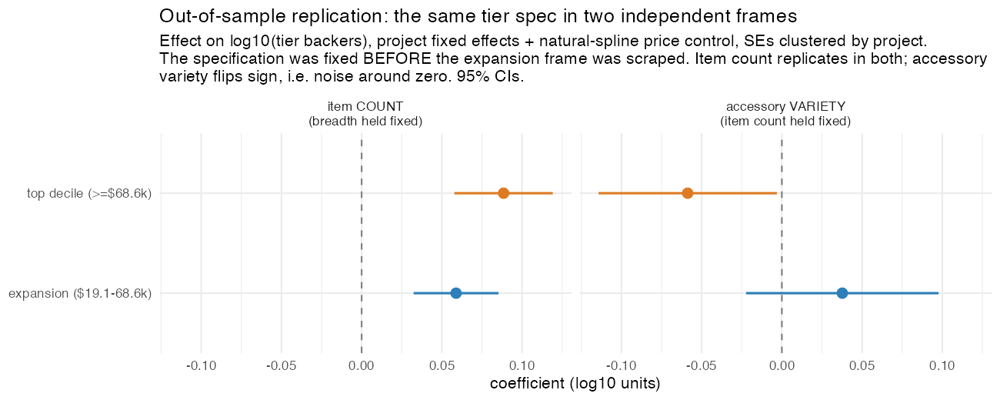

*The same tier-level model fit separately in each sample. Item count replicates; accessory variety does not, and its sign is not stable.*\
*Source: Wayback-recovered reward tiers, itemized subset, funded RPG books 2017–2022.*

## What the evidence supports

If you're running an RPG Kickstarter, these are the takeaways with some evidence behind them. Your **track record is your biggest asset**, and your past failures follow you. A **modest goal** correlates with funding, though that mostly reflects which creators set small goals in the first place. A **staff pick and a video** come with much bigger raises. **Naming a recognized system** (5e, OSR, a known indie line) is associated with clearing the funding bar a little more easily and with a somewhat larger raise. **How you frame the product**, premium object versus cheap commodity, shows up in the dollars. And within a campaign, the money comes from the **mid-premium reward tiers** ($100–500) rather than the entry PDFs or a single high-priced ceiling tier.

These are not guaranteed levers though! Almost everything here is a correlation drawn from observational data, with all the usual hazards: creators choose their goals strategically, Kickstarter chooses who gets staff-picked, my RPG classifier is imperfect,[^classifier] and the one result that is in the neighborhood of a causal effect is about a niche February program for zines.

---

### Footnotes

[^whales]: The original analysis ("Kickstarter Whales," guest post by Scipio202 on Patchwork Paladin) used ENWorld's list of 53 tabletop RPG campaigns that raised ≥ $1,000,000 and tracked four price points per campaign (cheapest digital, cheapest physical, most-common, and the top "whale" tier). It is a tier-level study of mega-successes; this post is a population-level study of the whole category.

[^classifier]: I validated the classifier on fresh, held-out Claude hand-labeled samples it had never seen: about 88% precision with recall preserved (no missed RPGs among the sampled non-RPG items) for the core-RPG class, up from ~77%/71% before I tightened it. The residual errors are mostly RPG accessories (map packs, dice, card decks) filed as core books rather than wholly unrelated products. For the regressions this label noise mostly behaves like random error that understates category differences, so those contrasts are conservative; for the dollar-share aggregates it is handled by the classifier cleanup.

[^survivorship]: Concretely: in the Web Robots data only about **2% of finished tabletop projects are marked "failed,"** versus a real-world failure rate somewhere around a third to a half. The crawl is essentially the successful subset. A useful cross-check: where the survivor data and the failure-aware data overlap, the funded projects' dollar amounts and backer counts match almost exactly, so the bias sits in which projects appear rather than in the numbers attached to them.

[^triangulation]: The three sources have complementary strengths and weaknesses. Web Robots: rich detail (video, staff pick, full text, creator IDs), 2014–2026, but funded-biased. Kaggle "ks-projects": includes failures and project names, but ends in early 2018. ICPSR 38050: includes failures through 2023 and has a usable creator ID, but masks project names (so I can identify RPGs only by linking to the other two). No single source does everything, so the analysis assigns each question to the source that can answer it.

[^rate]: "Success rate" here is successful ÷ (successful + failed), the standard convention. The two independent failure-aware sources agree closely on the 2009–2018 overlap (about 67% vs 69%), which is the kind of cross-source agreement that makes me trust the number.

[^auc]: I report out-of-sample discrimination (AUC, the area under the ROC curve): 0.5 is a coin flip, 1.0 is perfect. I also checked several model types (logistic regression, LASSO, random forest) and they agreed, which is a sign the result isn't an artifact of one method.

[^whovwhat]: The creator-history model reached an AUC of about **0.83**; the project-attribute model about **0.72**. They are built on different datasets (only one source has creator IDs *and* failures, only the other has project names), so this is a decomposition across sources rather than a head-to-head in one regression. It is robust, though, and the message is that reputation beats genre.

[^goal]: Among funded projects, pledged dollars are ≥ the goal essentially by definition (I checked: 0.00% of funded projects came in under goal). So the strong goal-pledged relationship for *funded* projects is largely an accounting identity rather than behavior. I keep the goal in the model only to hold project scale constant while reading the other coefficients.

[^video]: A wrinkle in the data: Web Robots only started recording whether a campaign has a video in its April 2024 crawls. Every project last seen before then is logged as "no video" regardless of the truth, so the video effect is identified entirely off campaigns captured in 2024 or later, where it is if anything a touch larger (about ×1.17). Read it as a recent-campaign association rather than a decade-long one, and that is also why I never plot video presence over time.

[^text]: Method, briefly: among funded RPG books, I turned titles and blurbs into a bag of words and bigrams and let a LASSO pick which ones predict log-dollars, with the vocabulary chosen separately inside each cross-validation fold so the test data couldn't leak in. Adding text lifted out-of-sample R² from about **0.68 to 0.70**, real but modest. Two cautions on interpretation. (1) The model memorizes specific successful series and brand names (Mothership, Forbidden Lands, Root, Dimgaard), which don't generalize. (2) Some "terms" are artifacts of how the text is tokenized: the bigram "dcc pathfinder" is not a product but two adjacent items in a system-compatibility list ("…AD&D, 5e, DCC, Pathfinder…"), and "softcover" is not a premium binding but a marker that the book is printed at all. Books that name *any* binding raise well above the PDF-only/zine baseline (hardcover ~$25k median, softcover ~$13k, neither ~$6k). The parts worth keeping are those structural signals, a physical print format and broad system compatibility, plus the low-end "pay-what-you-want / one-shot" pattern. I restrict this to books because in the pooled book-and-accessory version the strong terms were physical-product words (diorama, scenery, minis) that mostly identify the accessory class.

[^bookacc]: Formally, a joint test that all the book-vs-accessory differences are zero is decisively rejected (p < 0.00001) for the *magnitude* question, but is not significant (p ≈ 0.07) for the *funding* question. Translation: the slopes really do differ for "how much," but not for "whether."

[^did5e]: In an event study, the RPG-vs-control success gap is already positive and sizable in 2012 and flat thereafter; the formal "did the gap jump after mid-2014" interaction is statistically indistinguishable from zero for both funding and dollars. Diffuse, anticipated "events" resist causal identification, and this is a good illustration of why.

[^zinequest]: The estimate is about a 2× increase in funded RPG February launches. Because the comparison effectively has only ~12 years of data ("clusters"), a naive significance test overstates confidence; I re-ran it with a wild cluster bootstrap and a placebo test that asks whether any *other* month shows the same jump (none does, February is the unique outlier). The effect holds up. It is also worth noting this measures funded *entry* and dollars, not the success rate, since the rich data still can't see failures.

[^ogl]: Two independent problems collide on the OGL window: a source-side hole in the monthly crawl from mid-2022 to mid-2023 (which I verified is real, not a mistake on my end), and the name-masking in the only failure-aware source that reaches 2023. With neither entry, success, nor dollars observable for RPGs around January 2023, an event study isn't possible. A targeted re-scrape of that window is the way to revive it.

[^tiers]: Kickstarter's bulk datasets carry only campaign-level totals, so I recovered tier prices and per-tier backer counts from *archived* copies of the campaign pages on the Internet Archive's Wayback Machine, never hitting Kickstarter directly, by parsing the project data embedded in each snapshot. Coverage is partial: of the top decile of funded RPG books, about half (325) had an archived page near the campaign's end with parseable tiers. I used the snapshot closest to but not after the deadline, since Kickstarter hides ended tiers once a campaign closes. As a check, the per-tier backer counts sum to the project's own total to within a few percent; treating tier revenue as price × backers recovers about 76% of pledged (the remainder is over-pledging, add-ons, and shipping, which the page total includes but the per-tier figures do not).

[^bundles]: The tier *contents* come from re-parsing archived campaign pages I had already downloaded for the price analysis, so no new scraping was involved. Kickstarter's pre-2023 page template renders each tier's contents as an explicit itemized list; the template Kickstarter moved to afterwards renders rewards client-side, and the current one carries no itemization at all. Coverage is therefore a hard window rather than a random sample: zero before 2017, 58–85% of pages for campaigns launched 2017–2022, zero after. Everything in this subsection describes that window, on 415 books and about 3,400 itemized tiers. Two further limits. Items are classified into categories by keyword rules on creator-written text, which is fuzzy, and about a fifth of items stay unclassified (mostly project-specific content names); the project-level null is unchanged if every unclassified item is generously counted as an accessory. And the itemizations are cumulative, since a higher tier says "everything above, plus…", so bundle size rises with price by construction. The models control for price with a flexible spline and are re-run dropping each campaign's cheapest and dearest tier; the item-count effect survives both.

[^bundlereplication]: The tier-level models use campaign fixed effects, so they compare tiers against other tiers in the same campaign, with standard errors clustered by campaign (tiers within a campaign are not independent, and treating them as such understates the uncertainty by about half). On the out-of-sample test: the original tier sample was the top decile of funded RPG books; the second sample extends to the rest of the top quartile, campaigns roughly five times smaller, collected afterwards with the specification already fixed. One caution that this exercise turned up and that I would have got wrong otherwise: pooling the two samples makes the *project-level* breadth effect look real (+0.031, *p* = 0.005), because the two samples differ in both bundle breadth and campaign size, and a pooled regression reads that between-sample gradient as an effect. Fitting within each sample separately, as reported above, it disappears. About half the archived pages were captured mid-campaign, so tier backer counts are often partial; a uniform undercount is absorbed by the campaign fixed effect, and the estimate is the same in pages captured early and late.

[^creatorfe]: Creator fixed effects on the 212 campaigns run by the 70 creators with at least two in the bundle sample; 51 of those creators actually vary their bundle breadth between campaigns, and the within-creator spread of breadth is about 80% of the overall spread, so the design is not starved of variation. The estimate is stable across specifications (creator alone +0.012, creator plus year +0.011, adding a campaign-sequence term +0.013), and it is 0.048 with *p* = 0.001 on the identical sample when creator effects are dropped, which is the whole point. With only ~70 clusters I report CR2 standard errors and a null-imposed wild cluster bootstrap alongside the conventional ones; they agree closely (*p* = 0.62 and 0.61). This addresses selection on the creator, not selection on the campaign: a creator who bundles more heavily *for a particular book because they expect that book to do well* would still bias the estimate upward, and the result is a null regardless.

[^tierframe]: The tier sample pools two scrapes: the top decile of funded RPG books across all years, and the rest of the top quartile restricted to campaigns launched 2017–2022 (which is where the archived pages are richest). That makes the pooled frame ragged — the smallest size band exists only because of the second scrape, so campaign size and era are entangled in it. This is why I report the size bands separately rather than leaning on a single pooled median: the by-band figures are the estimand I actually want, and each band is a describable population. As a check, re-running the bands on 2017–2022 campaigns alone reproduces the gradient almost exactly (top-grossing tier $50 / $60 / $78 / $120 across the bands, versus $50 / $65 / $85 / $127 pooled; premium-tier dollar share 20% / 29% / 35% / 56% versus 20% / 31% / 42% / 63%), so the gradient is about size, not about which years each band happens to cover. Band composition is in `tables/tier_frame_composition.csv`. One analysis deliberately stays on the top decile alone: the real-terms price ladder earlier in the post, because that is a per-year series and folding in a scrape that only covers 2017–2022 would inject a composition-driven dip in exactly those years and read as products getting cheaper.

[^composition]: System and product-type tags come from keyword rules on each book's title and blurb, assigning one label per axis by a priority order. They are fuzzy — PbtA and other indie systems are *undercounted* because those books rarely say "PbtA" on the tin, and a chunk of books name no system at all — so read the trends and the broad shares rather than the second decimal. The composition charts are funded books only (the rich crawl can't see failures), and the 2022–23 coverage gap thins those years.

[^sysprem]: Same funded-books regression as the magnitude model above, now with the system-family and product-type tags added (premiums are relative to a system-agnostic rulebook, standard errors clustered by creator). On effect size: adding the tags lifts cross-validated R² only from about 0.675 to 0.683, real but small. The success-side claim uses the failure-aware Kaggle data, where adding the tags improves out-of-sample discrimination from AUC ≈ 0.70 to ≈ 0.74; those tags are name-only (no blurb) and pre-2019, so treat them as suggestive. As everywhere here, keyword-tag noise attenuates the contrasts toward zero, so if anything these premiums are understated.

[^rd]: This is a regression-discontinuity design at the 100%-of-goal cutoff, run on the failure-aware data (the only source with the just-missed projects on the left of the line). The formal manipulation test (McCrary/rddensity) rejects a smooth density overwhelmingly (p ≈ 4×10⁻⁸⁶), which invalidates the design. For the record, the naive estimate of "barely funding → relaunching" is about −0.28 under a local-linear fit but a non-significant −0.10 under a local-quadratic one, the instability you expect when the running variable is manipulated. What holds up is the smooth dose-response on both sides: more raised relative to goal predicts a higher chance of launching again.

[^market]: A few caveats. These are *funded*-project dollars (the survivor population the rich crawl captures), but dollar totals are the most capture-robust thing here, since failed campaigns raise almost nothing and the trend is trustworthy even where raw counts aren't. "Games" means Kickstarter's Games category (tabletop, video games, card games, and so on) rather than the whole platform; I can't line RPGs up against Film or Comics because I only kept the Games category. And a robustness note on the share itself: because the money is so concentrated, a single huge project can swing a year. The 2024 peak (~24%) is the clearest case. Strip the top 1% of projects each year and the whole series falls to roughly 7% → 14%, which is why I describe it as a *doubling* rather than reading the raw 2024 number literally.

[^cleanlabels]: An earlier cut of this used a keyword classifier that mislabeled some board games, dice sets, and card games as "RPGs." Because the data is so dollar-skewed, a few of those swung the aggregates hard: *Darkest Dungeon: The Board Game*, a $3.9M card game, a $3.5M dice gadget and the like were about **13% of "RPG" dollars overall and 22% of the top 1%**. I tightened the classifier so board/card/video-game and accessory cues override a stray "RPG" mention (a game stays "RPG" only if its title actually says "roleplaying game" or it has real rulebook content); on the high-dollar tail it now agrees with hand-checking about **97%** of the time. This barely moved the regression results, since coefficients shrug off a handful of mislabels and label noise mostly *attenuates* contrasts, but it did trim the dollar-share and concentration figures, which one big mislabel can distort. The share-of-gaming numbers above are post-cleanup.

[^goaltrend]: Among funded projects only, so read it as "goals among projects that made it," not the full population. Part of the decline is compositional, since the post-2019 flood of small-goal zines drags the median down, and part is creators simply gravitating to modest, beatable goals as the norm.

[^fundingera]: Concretely: the Kaggle export carries project *names* (so I can pick out RPGs) but ends in early 2018, while the academic set reaches 2023 but masks names (so its RPG-level signal is borrowed, and its creator-history model is really an *all-tabletop* model). Either way, the "did it fund / what predicts funding" evidence is anchored in the 2010s and in tabletop broadly. The magnitude ("how much") side, by contrast, uses the 2014–2026 Web Robots crawl and is genuinely RPG-specific and current, so the time-scope caveat bites hardest on the funding-side claims and less on the dollars-side ones.

[^rpgonly]: This model pools all tabletop and includes "is an RPG" as a predictor, so the goal, campaign-length, and US slopes are estimated as *common* across tabletop. Re-estimating on RPG projects only (n ≈ 1,100, name-identified) keeps the RPG-relevant findings and clarifies the rest: the goal effect is, if anything, sharper (a tenfold-larger goal still cuts the odds of funding by about two-thirds), and the D&D/5e label stays positive (now only marginally significant, *p* ≈ 0.06). The campaign-length and US-based effects, by contrast, lose significance entirely within RPGs; they are tabletop-wide regularities, driven largely by board games, rather than RPG-specific ones. The smaller, name-only RPG sample has limited power, so treat those vanishing effects as *unresolved* rather than shown to be zero.

[^realterms]: I deflate nominal pledged dollars to constant 2025 dollars with the BLS Consumer Price Index for All Urban Consumers (CPI-U, U.S. city average, all items, annual averages); cumulative inflation from 2015 to 2025 is about 36%. The sample is funded core RPG books only (the survivor population) for launch years 2015–2025, with 2026 dropped as a partial year, and the same deflation and funded-only caveat apply to the goals creators set. Two caveats temper the *size* of the per-project decline, though not its direction. First, recent crawls capture far more small projects than older snapshots did, so the early years over-represent larger survivors and part of the median's fall reflects better coverage of the cheap tail rather than pure shrinkage; the steadier per-backer-pledge decline, a within-project ratio, is the more robust evidence. Second, the *total* real-market figure is the most coverage- and whale-sensitive number here (2024 is inflated by the $15M Cosmere RPG; the 2022–23 dip is the coverage gap), so read the +220% as directional rather than exact. The 2025 CPI average is itself provisional.

[^deluxe]: These tier prices come from the same Wayback-recovered sample as the whale-tier section below, the top decile of funded RPG books, about 325 projects with an archived page near the deadline, so read them as a price-point check on big, successful books rather than the whole population. I classify tiers by title keyword (digital/PDF, hardcover, deluxe/collector), which is low-coverage since vanity names like "adventurer" carry no format, and take the cheapest labelled tier of each type per project, then the yearly median. The deluxe line uses the *money-max* tier (the single highest-revenue tier per campaign), which clusters at the deluxe-hardcover price and, unlike the most-expensive "whale" tier, isn't dominated by a handful of huge campaigns. Yearly medians ride on tens of projects, so read the levels rather than the year-to-year wiggles.
